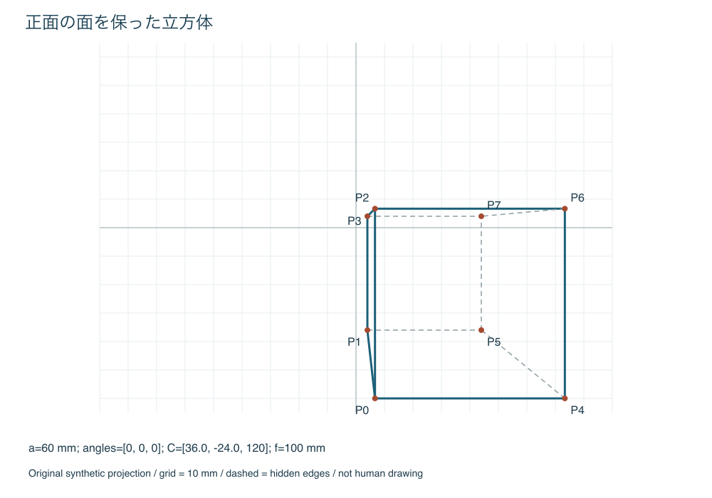
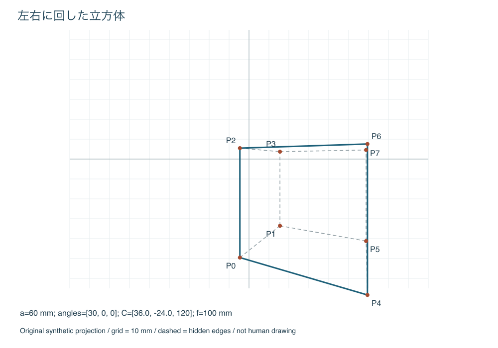
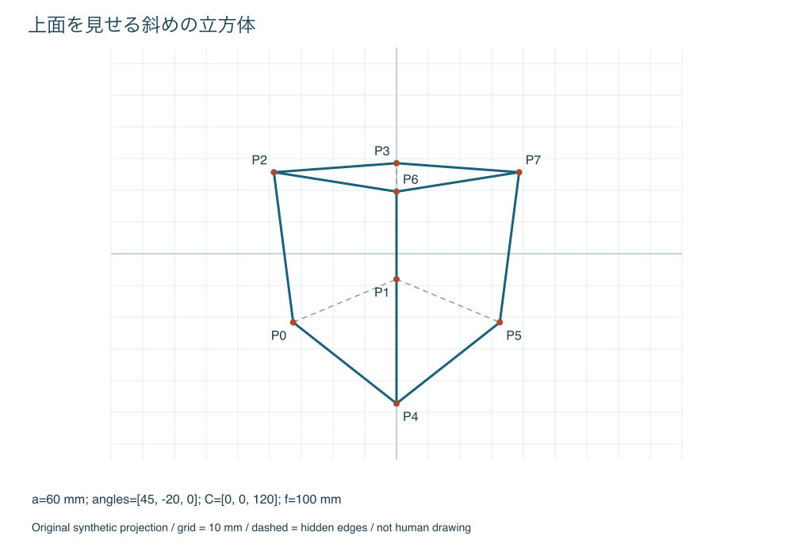

# 立方体作図の記入済み例

独自の合成計算例。人の作図結果ではない。丸め値は半径80mmの円を0.5mm刻みで読み、半辺を0.001mm、縮尺を小数6桁、最終座標を0.1mmに丸めた計算シミュレーション。

[手順書](../../docs/cube-construction-manual.md)の入力・角度・符号表と対応する。理想値と丸め値は別欄。視線法も同じX・Y・Zを使うため、sZとsX、sZとsYの交点をそれぞれ読む。

## 正面の面を保った立方体

入力：a=60mm、角度α・β・γ=[0, 0, 0]度、C=[36.0, -24.0, 120]mm、f=100mm、紙上倍率1。補助図縮尺s=1.0。

| 角 | cosに対応する横成分 | sinに対応する縦成分 | 円の読みを丸めた横成分 | 同縦成分 |
| --- | --- | --- | --- | --- |
| 0度 | 1.000000 | 0.000000 | 1.000000 | 0.000000 |
| 0度 | 1.000000 | 0.000000 | 1.000000 | 0.000000 |
| 0度 | 1.000000 | 0.000000 | 1.000000 | 0.000000 |

| 半辺 | X | Y | Z |
| --- | --- | --- | --- |
| h1 | 30.000000 | 0.000000 | 0.000000 |
| h2 | 0.000000 | 30.000000 | 0.000000 |
| h3 | 0.000000 | 0.000000 | 30.000000 |

| 頂点 | 符号 | X | Y | Z | 理想u | 理想v | 丸めu | 丸めv |
| --- | --- | --- | --- | --- | --- | --- | --- | --- |
| P0 | −−− | 6.000 | -54.000 | 90.000 | 6.667 | -60.000 | 6.700 | -60.000 |
| P1 | −−+ | 6.000 | -54.000 | 150.000 | 4.000 | -36.000 | 4.000 | -36.000 |
| P2 | −+− | 6.000 | 6.000 | 90.000 | 6.667 | 6.667 | 6.700 | 6.700 |
| P3 | −++ | 6.000 | 6.000 | 150.000 | 4.000 | 4.000 | 4.000 | 4.000 |
| P4 | +−− | 66.000 | -54.000 | 90.000 | 73.333 | -60.000 | 73.300 | -60.000 |
| P5 | +−+ | 66.000 | -54.000 | 150.000 | 44.000 | -36.000 | 44.000 | -36.000 |
| P6 | ++− | 66.000 | 6.000 | 90.000 | 73.333 | 6.667 | 73.300 | 6.700 |
| P7 | +++ | 66.000 | 6.000 | 150.000 | 44.000 | 4.000 | 44.000 | 4.000 |

| 頂点 | sZ | sX | sY | 交点の横読み su | 縦読み sv |
| --- | --- | --- | --- | --- | --- |
| P0 | 90.000 | 6.000 | -54.000 | 6.667 | -60.000 |
| P1 | 150.000 | 6.000 | -54.000 | 4.000 | -36.000 |
| P2 | 90.000 | 6.000 | 6.000 | 6.667 | 6.667 |
| P3 | 150.000 | 6.000 | 6.000 | 4.000 | 4.000 |
| P4 | 90.000 | 66.000 | -54.000 | 73.333 | -60.000 |
| P5 | 150.000 | 66.000 | -54.000 | 44.000 | -36.000 |
| P6 | 90.000 | 66.000 | 6.000 | 73.333 | 6.667 |
| P7 | 150.000 | 66.000 | 6.000 | 44.000 | 4.000 |

丸め経路の最大座標差：0.0471mm。ここには実際の点打ち・線引きの誤差を含まない。

## 左右に回した立方体

入力：a=60mm、角度α・β・γ=[30, 0, 0]度、C=[36.0, -24.0, 120]mm、f=100mm、紙上倍率1。補助図縮尺s=0.5。

| 角 | cosに対応する横成分 | sinに対応する縦成分 | 円の読みを丸めた横成分 | 同縦成分 |
| --- | --- | --- | --- | --- |
| 30度 | 0.866025 | 0.500000 | 0.868750 | 0.500000 |
| 0度 | 1.000000 | 0.000000 | 1.000000 | 0.000000 |
| 0度 | 1.000000 | 0.000000 | 1.000000 | 0.000000 |

| 半辺 | X | Y | Z |
| --- | --- | --- | --- |
| h1 | 25.980762 | 0.000000 | -15.000000 |
| h2 | 0.000000 | 30.000000 | 0.000000 |
| h3 | 15.000000 | 0.000000 | 25.980762 |

| 頂点 | 符号 | X | Y | Z | 理想u | 理想v | 丸めu | 丸めv |
| --- | --- | --- | --- | --- | --- | --- | --- | --- |
| P0 | −−− | -4.981 | -54.000 | 109.019 | -4.569 | -49.533 | -4.600 | -49.600 |
| P1 | −−+ | 25.019 | -54.000 | 160.981 | 15.542 | -33.544 | 15.500 | -33.500 |
| P2 | −+− | -4.981 | 6.000 | 109.019 | -4.569 | 5.504 | -4.600 | 5.500 |
| P3 | −++ | 25.019 | 6.000 | 160.981 | 15.542 | 3.727 | 15.500 | 3.700 |
| P4 | +−− | 46.981 | -54.000 | 79.019 | 59.455 | -68.338 | 59.600 | -68.400 |
| P5 | +−+ | 76.981 | -54.000 | 130.981 | 58.773 | -41.227 | 58.800 | -41.200 |
| P6 | ++− | 46.981 | 6.000 | 79.019 | 59.455 | 7.593 | 59.600 | 7.600 |
| P7 | +++ | 76.981 | 6.000 | 130.981 | 58.773 | 4.581 | 58.800 | 4.600 |

| 頂点 | sZ | sX | sY | 交点の横読み su | 縦読み sv |
| --- | --- | --- | --- | --- | --- |
| P0 | 54.510 | -2.490 | -27.000 | -2.284 | -24.766 |
| P1 | 80.490 | 12.510 | -27.000 | 7.771 | -16.772 |
| P2 | 54.510 | -2.490 | 3.000 | -2.284 | 2.752 |
| P3 | 80.490 | 12.510 | 3.000 | 7.771 | 1.864 |
| P4 | 39.510 | 23.490 | -27.000 | 29.727 | -34.169 |
| P5 | 65.490 | 38.490 | -27.000 | 29.386 | -20.614 |
| P6 | 39.510 | 23.490 | 3.000 | 29.727 | 3.797 |
| P7 | 65.490 | 38.490 | 3.000 | 29.386 | 2.290 |

丸め経路の最大座標差：0.1579mm。ここには実際の点打ち・線引きの誤差を含まない。

## 上面を見せる斜めの立方体

入力：a=60mm、角度α・β・γ=[45, -20, 0]度、C=[0, 0, 120]mm、f=100mm、紙上倍率1。補助図縮尺s=0.5。

| 角 | cosに対応する横成分 | sinに対応する縦成分 | 円の読みを丸めた横成分 | 同縦成分 |
| --- | --- | --- | --- | --- |
| 45度 | 0.707107 | 0.707107 | 0.706250 | 0.706250 |
| -20度 | 0.939693 | -0.342020 | 0.937500 | -0.343750 |
| 0度 | 1.000000 | 0.000000 | 1.000000 | 0.000000 |

| 半辺 | X | Y | Z |
| --- | --- | --- | --- |
| h1 | 21.213203 | -7.255343 | -19.933891 |
| h2 | 0.000000 | 28.190779 | -10.260604 |
| h3 | 21.213203 | 7.255343 | 19.933891 |

| 頂点 | 符号 | X | Y | Z | 理想u | 理想v | 丸めu | 丸めv |
| --- | --- | --- | --- | --- | --- | --- | --- | --- |
| P0 | −−− | -42.426 | -28.191 | 130.261 | -32.570 | -21.642 | -32.500 | -21.600 |
| P1 | −−+ | -0.000 | -13.680 | 170.128 | -0.000 | -8.041 | 0.000 | -8.000 |
| P2 | −+− | -42.426 | 28.191 | 109.739 | -38.661 | 25.689 | -38.600 | 25.600 |
| P3 | −++ | -0.000 | 42.701 | 149.607 | -0.000 | 28.542 | 0.000 | 28.600 |
| P4 | +−− | 0.000 | -42.701 | 90.393 | 0.000 | -47.240 | 0.000 | -47.100 |
| P5 | +−+ | 42.426 | -28.191 | 130.261 | 32.570 | -21.642 | 32.500 | -21.600 |
| P6 | ++− | 0.000 | 13.680 | 69.872 | 0.000 | 19.579 | 0.000 | 19.400 |
| P7 | +++ | 42.426 | 28.191 | 109.739 | 38.661 | 25.689 | 38.600 | 25.600 |

| 頂点 | sZ | sX | sY | 交点の横読み su | 縦読み sv |
| --- | --- | --- | --- | --- | --- |
| P0 | 65.130 | -21.213 | -14.095 | -16.285 | -10.821 |
| P1 | 85.064 | -0.000 | -6.840 | -0.000 | -4.021 |
| P2 | 54.870 | -21.213 | 14.095 | -19.331 | 12.844 |
| P3 | 74.804 | -0.000 | 21.351 | -0.000 | 14.271 |
| P4 | 45.196 | 0.000 | -21.351 | 0.000 | -23.620 |
| P5 | 65.130 | 21.213 | -14.095 | 16.285 | -10.821 |
| P6 | 34.936 | 0.000 | 6.840 | 0.000 | 9.789 |
| P7 | 54.870 | 21.213 | 14.095 | 19.331 | 12.844 |

丸め経路の最大座標差：0.1789mm。ここには実際の点打ち・線引きの誤差を含まない。

## 全例で結ぶ辺

P0–P1, P0–P2, P0–P4, P1–P3, P1–P5, P2–P3, P2–P6, P3–P7, P4–P5, P4–P6, P5–P7, P6–P7。実線・破線は面の向きで分ける。
