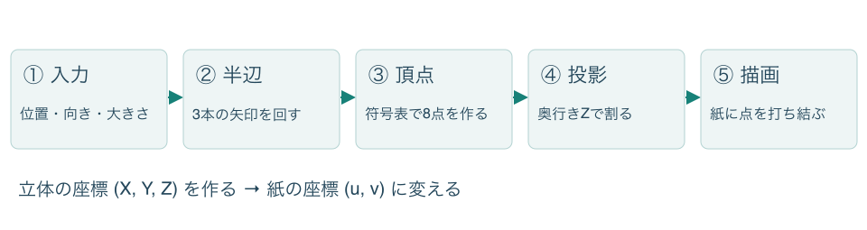
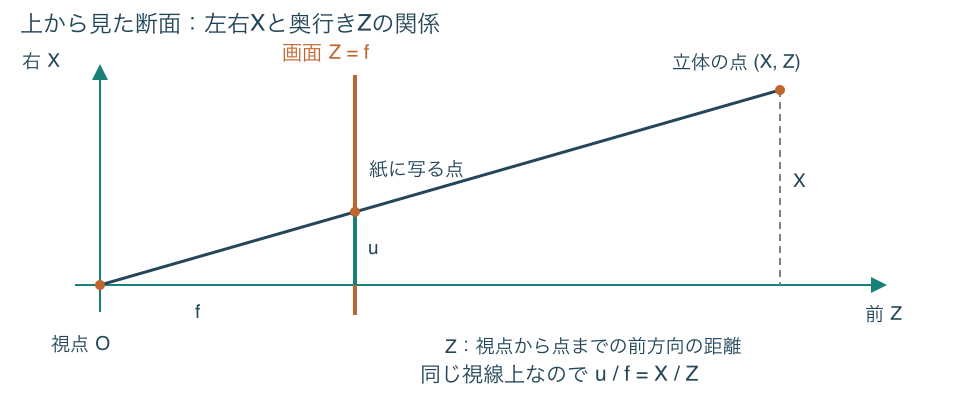
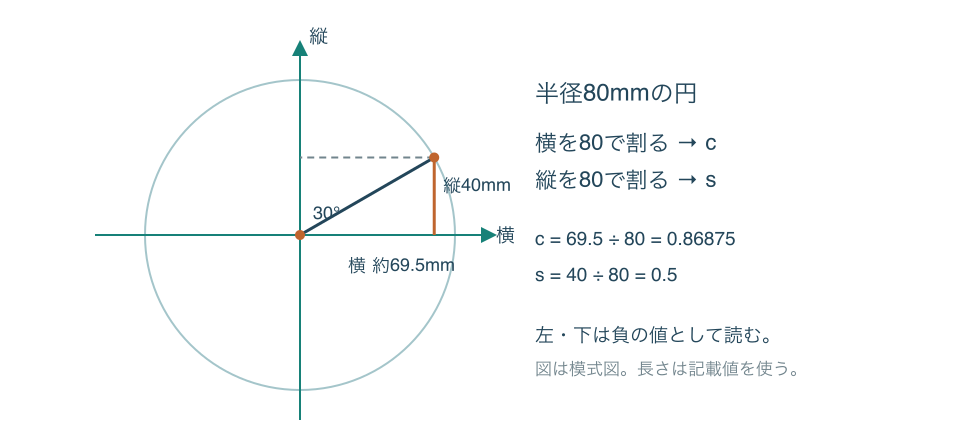
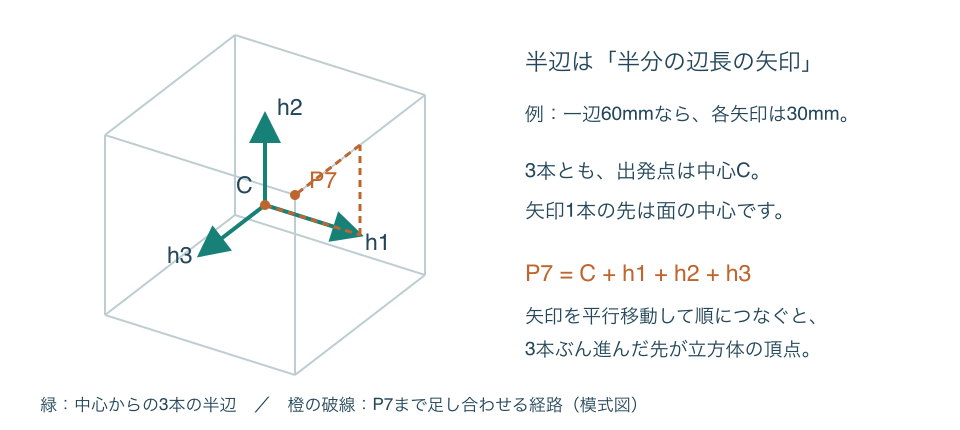
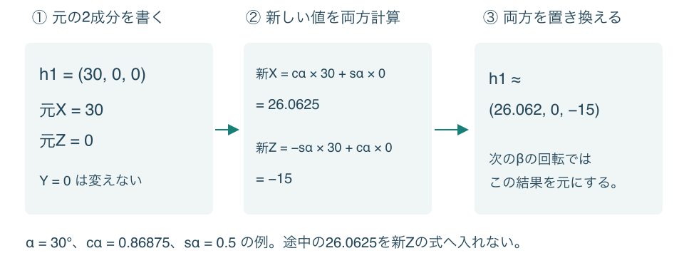
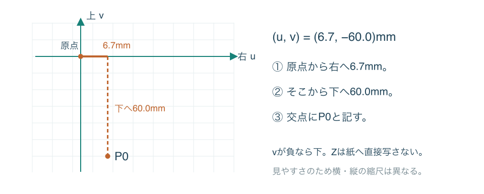
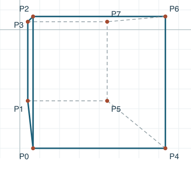
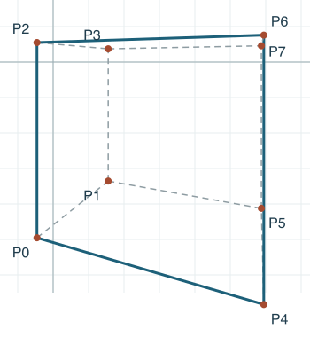
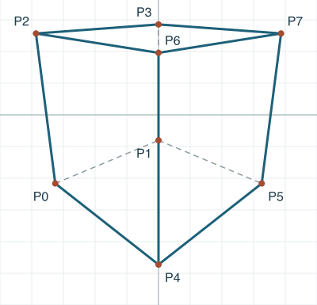
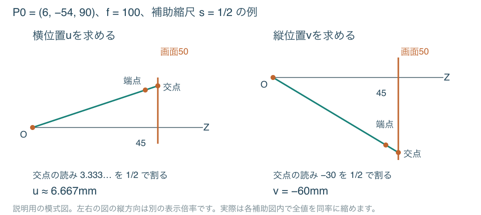

# 紙と計算機で奥行きのある立方体を描く

**指定した位置・向きの立方体を、8つの点から組み立てる手順書**  
改訂版・2026年10月2日

この手順では、まず立方体の8頂点が空間のどこにあるかを求めます。次に、それぞれの点を「目の前の平面に写した位置」へ変換し、方眼紙に点を打って結びます。消失点の位置を先に探さなくても、奥行きのある立方体を作図できます。



**最初は作例1の条件を使い、第1〜7章を順に進めてください。** 作例1は回転角がすべて0度なので、円から角度を読み取る工程と回転計算を飛ばせます。まず一つ完成させてから、作例2・3で回転を加えると、各計算の役割を追いやすくなります。

| 読むところ | そこで分かること |
| --- | --- |
| 第1〜2章 | 立体と紙の座標の違い、用意する道具、最初に決める入力 |
| 第3〜5章 | 円から角度の成分を読む方法、半辺の意味、回転の計算 |
| 第6〜7章 | 半辺から8頂点を作り、紙上の位置へ変換して結ぶ方法 |
| 第8〜10章 | 一点・二点・三点透視の完成図と、照合用の8頂点の表 |
| 第11〜12章 | 視線の図による別解、失敗の診断、適用範囲と用語 |
| 付録 | 自分で書き込む作業表と、詳しい研究資料の案内 |

本書の図・数値は研究側が作成した見本です。幾何学的な一致と仮想的な誤差は点検していますが、人による使いやすさ・所要時間・上達の確認は行っていません。

## 1　立体の点を「紙に写る点」へ変える

### 三つの座標と二つの座標を分ける

目に相当する一点を**視点**と呼びます。視点を基準として、右へどれだけ離れているかをX、上へどれだけ離れているかをY、前へどれだけ離れているかをZとします。左・下の位置は負の数です。本書で描く立方体は、全頂点のZが正になるものに限ります。

例えば立体の点(6, −54, 90)mmは、「視点から右へ6mm、下へ54mm、前へ90mmの位置」です。これはまだ、紙に直接打つ位置ではありません。

目の前に、正面を向く基準方向（Z方向）と直角な透明の板を置いたと考えてください。この板を**画面**と呼び、視点から板までの距離をfとします。立体の点へ向かう視線が板を通る場所が、描くべき点です。板の横位置をu、縦位置をvと呼び、最後に方眼紙へ写します。



図は上から見た断面で、上下の高さYは省いています。視点から点へ向かう直線と、Z=fの画面との交点を取ります。紙上倍率m=1なら、相似な三角形の関係からu=f×X÷Zとなり、縦方向も同じ考え方でv=f×Y÷Zになります。

**ここでの確認：** X・Y・Zは立体の位置、u・vは紙へ移す位置です。Zは、目から点までの斜めの直線距離ではなく、前方向に測った距離です。

## 2　道具と入力を用意する

### 使う道具

方眼紙、コンパス、分度器、45度と30度・60度の三角定規、直線定規、鉛筆、消しゴム、四則演算ができる卓上計算機を用意します。関数電卓、印刷済みの三角比表、スマートフォンは必要ありません。作業表は紙へ書き写せます。

補助線は薄く、最後に残す辺は濃く描きます。平行線を移すときは、三角定規の一方を固定したガイドにし、もう一方を滑らせます。垂線は直角の角を使います。数値の表と完成図を別の紙にしても構いません。

### 入力欄を先に埋める

| 記号 | 決めるもの | 作例1で使う値 |
| --- | --- | --- |
| a | 実物として考える立方体の一辺。紙上の辺長とは別 | 60mm |
| C=(Xc, Yc, D) | 視点を基準とする立方体の中心の位置 | (36, −24, 120)mm |
| α・β・γ | 立方体の向きを変える3回の回転。順序は固定 | 0度・0度・0度 |
| f | 視点から仮想の画面までの距離 | 100mm |
| m | 画面上の図を紙へ何倍で写すか | 1 |
| 紙の原点 | u=0、v=0を置く位置 | 作図範囲の中央 |

作例1では、中心は右へ36mm、下へ24mm、前へ120mmです。紙には原点から左右各90mm、上下各125mmの範囲を確保します。作図範囲の中央と立方体の中心の投影位置は、同じとは限りません。

### D・f・mは何を変えるか

Dを変えると立方体を前後に移動させます。fを変えると仮想の板の位置が変わり、同じ立体の投影全体が拡大・縮小します。mはその投影を紙に収めるための倍率です。**立方体までの距離Dと、画面までの距離fを交換しないでください。**

例えばfを100から50へ変えれば、同じ立体のu・vはすべて半分になります。Dを120から240へ変える場合は、各頂点のZへ同じ120を足すため、単純な一律半分とはなりません。

紙外へ出ると分かったら、mを1/2などへ変更し、全点をその倍率で計算し直します。遠い側だけ縮めるなど、点ごとに倍率を変える操作はしません。

## 3　角度の成分を円から読み取る

**この章の成果は、各角度についてcとsの二つの数を用意することです。** cは円の横成分、sは縦成分を、半径で割った値です。計算式の記号を使いますが、関数電卓のcos・sinキーを押す必要はありません。

作例1では3角度とも0度です。0度はc=1、s=0と分かるので、この章の作図を省略できます。作例2では30度の組を一つ、作例3では45度と−20度の組を用意します。



1. 半径80mmの円を描き、中心を通る横軸と縦軸を引きます。右向きの半径を0度にします。
2. 分度器の中心を円の中心へ合わせ、正の角度は反時計回り、負の角度は時計回りに取ります。その方向の半径と円の交点に印を付けます。
3. 交点から横軸・縦軸へ垂線を下ろし、中心からの横の距離と縦の距離を読みます。左側・下側なら負を付けます。
4. 横の値を80で割ってc、縦の値を80で割ってsとし、どの角度の値か分かるように記録します。

30度なら、横の読みを約69.5mm、縦を40mmとして、c=69.5÷80=0.86875、s=40÷80=0.5です。この横の読みには丸めが含まれ、理想的な円の値と完全には一致しません。

本書の計算見本は0.5mm刻みの読み、c・sは小数6桁までの保存を使います。半径を変えた場合は、割る数もその半径に変えてください。30・45・60度の方向は、三角定規でも取れます。

**ここでの確認：** c・sにはmmを付けません。「長さ÷半径」で得る比だからです。−20度なら交点は横軸の下にあるので、cは正、sは負になります。

## 4　半辺を使って立方体を表す

**半辺とは、辺長の半分だけ進む矢印です。** 矢印は向きと長さを持ち、本書ではその横・縦・奥行きの成分を(X, Y, Z)で書きます。半辺の成分は中心からの移動量で、視点から測る頂点の位置とは役割が違います。

一辺60mmなら、回す前の3本を次のようにします。

| 半辺 | 成分 | 意味 |
| --- | --- | --- |
| h1 | (30, 0, 0)mm | 中心から右へ30mm進む |
| h2 | (0, 30, 0)mm | 中心から上へ30mm進む |
| h3 | (0, 0, 30)mm | 中心から前へ30mm進む |



3本は立方体の互いに直交する辺方向を表します。中心から1本だけ進んだ先は面の中心で、まだ角には届きません。中心Cからh1、h2、h3を順に足すと、3方向へ半分ずつ進み、頂点P7へ届きます。矢印を足すときは、長さと向きを変えずに、次の矢印の出発点を前の矢印の先へ移すと考えます。

反対向きへ進むなら引き算にします。例えばP0はC−h1−h2−h3です。3本それぞれに足す・引くの2通りがあるため、2×2×2=8個の頂点を作れます。

**ここでの確認：** 半辺1本は辺長30mmの小さな立方体ではありません。また、半辺を回すと成分が変わっても、理想的な回転なら矢印自体の長さは30mmのままです。

## 5　三本の半辺を順に回す

### 回転はα、β、γの順

立方体の中心Cを動かさず、3本の半辺の向きを変えます。回転軸は、最初に決めた視点座標のY軸、X軸、Z軸に平行な、中心Cを通る軸です。直前に傾いた立方体の辺を次の回転軸にはしません。

| 順序 | 変える成分と計算 | そのまま残す成分 |
| --- | --- | --- |
| α：Y方向の軸のまわり | 新X=cα×元X+sα×元Z ／ 新Z=−sα×元X+cα×元Z | Y |
| β：X方向の軸のまわり | 新Y=cβ×元Y−sβ×元Z ／ 新Z=sβ×元Y+cβ×元Z | X |
| γ：Z方向の軸のまわり | 新X=cγ×元X−sγ×元Y ／ 新Y=sγ×元X+cγ×元Y | Z |

cαはαの角度から読み取ったc、sαは同じ角度のsです。β・γも同様です。αは左右の向き、βは上面・底面の見せ方、γは画面内の傾きを調整します。複数を組み合わせた結果は順番に依存します。

### 1本ずつ、元の値を残して計算する

h1についてαの計算を行い、その結果をβへ、さらにγへ渡します。同じことをh2・h3にも行います。角度が0度の段階はそのまま通過できます。**一つの段階では、新しい2成分を両方計算してから置き換えてください。**



作例2のh1では、元X=30、元Z=0です。新X=0.86875×30+0.5×0=26.0625、新Z=−0.5×30+0.86875×0=−15となります。新Zの式へ、今求めた26.0625を元Xとして入れると、別の計算になってしまいます。

途中は計算機が保持できる桁数で進め、3回の回転が終わった半辺を0.001mm単位で保存します。本書の見本は中間値がちょうど境界のとき末尾を偶数へ丸めています（26.0625→26.062）。通常の四捨五入を使うと最終桁が0.001mm違う場合があります。使った規則を表に残してください。

**ここでの確認：** 回す対象は半辺です。中心Cをこの式で回しません。作例2の結果はh1=(26.062, 0, −15)、h2=(0, 30, 0)、h3=(15, 0, 26.062)mmになります。

## 6　足し引きで八つの頂点を作る

ここで初めて、半辺の移動量に中心の位置Cを足します。表の符号は、h1・h2・h3のそれぞれについて進む方向を指定しています。X・Y・Zの各成分に同じ符号の組を適用します。

| 点 | 中心からの進み方 | 計算 |
| --- | --- | --- |
| P0 | −、−、− | C−h1−h2−h3 |
| P1 | −、−、＋ | C−h1−h2＋h3 |
| P2 | −、＋、− | C−h1＋h2−h3 |
| P3 | −、＋、＋ | C−h1＋h2＋h3 |
| P4 | ＋、−、− | C＋h1−h2−h3 |
| P5 | ＋、−、＋ | C＋h1−h2＋h3 |
| P6 | ＋、＋、− | C＋h1＋h2−h3 |
| P7 | ＋、＋、＋ | C＋h1＋h2＋h3 |

### 作例1のP0を一行ずつ求める

C=(36, −24, 120)、h1=(30, 0, 0)、h2=(0, 30, 0)、h3=(0, 0, 30)を使います。

```text
X = 36 − 30 − 0 − 0 = 6
Y = −24 − 0 − 30 − 0 = −54
Z = 120 − 0 − 0 − 30 = 90
したがって P0 = (6, −54, 90)mm
```

P7では同じ半辺をすべて足し、(66, 6, 150)mmになります。P0とP7は中心を挟んで反対側の頂点なので、成分ごとの和は(72, −48, 240)=2Cです。他の対向頂点P1とP6、P2とP5、P3とP4でも同じ確認ができます。

**ここで止めて確認：** 全8点のZが正であることを調べます。0以下の点がある場合、通常の手順を続けません。Dを大きくするなど入力を見直します。Zが非常に小さい場合も、わずかな読み違いが大きく拡大されます。

## 7　奥行きで割り、紙に点を打って結ぶ

### 各頂点に、その頂点の縮尺を使う

同じ大きさでも、遠いものほど小さく写ります。この違いを各頂点のk=f÷Zで表します。8点それぞれに次の計算を行います。

```text
k = f ÷ Z
u = m × k × X
v = m × k × Y
```

kは小数6桁、u・vは0.1mm単位で記録します。作例1のP0では、k=100÷90≈1.111111、u=1×1.111111×6≈6.7mm、v=1×1.111111×(−54)≈−60.0mmです。



まず原点から右へ6.7mm進み、そこから下へ60.0mm進んだ場所にP0と記します。vの負号は「下」を意味します。他の点もすべて同じ原点から測ります。前の頂点から次の頂点のu・vだけ進む、という操作にはしません。

Zが同じ行ではkを共有できます。作例1はZが90と150の2種類なので、割算は2回です。表示が近いだけのZを無理に同じ値へ丸めて共有しないでください。

### 十二本の辺を結ぶ

結ぶ組は、P0–P1、P0–P2、P0–P4、P1–P3、P1–P5、P2–P3、P2–P6、P3–P7、P4–P5、P4–P6、P5–P7、P6–P7です。符号表で一つの符号だけが違う点どうしが、一本の辺でつながります。

初回は12本を薄く引き、作例と照合してから見える辺を濃くします。隠れた辺も破線で残すと、点のつなぎ間違いを確認できます。紙上で12辺の長さを同じに直してはいけません。等しいのは投影前の実長で、紙に写った長さは向きと奥行きで変わります。

**作例の読み方：** 3例ともa=60mm、f=100mm、m=1です。図は理想投影、表は円の読みと計算途中を丸めた値です。図は頂点を見やすく拡大し、作例ごとに表示倍率が異なります。方眼は10mm間隔を表しますが、画面・PDFの表示寸法ではなく、表のmm値を手元の紙へ取ってください。

## 8　作例1：正面の面を保つ（一点透視）

角度の準備と回転を飛ばせる、最初の作例です。中心を右へ36mm、下へ24mmに置いています。

**入力：** 中心C=(36, −24, 120)mm、α・β・γ=0度・0度・0度。辺長・画面距離・紙上倍率は上記の共通値です。



**1点を計算する例：** P0=(6, −54, 90)なので、k=100÷90≈1.111111、(u, v)≈(6.7, −60.0)mmです。紙の原点から右へ6.7mm、下へ60.0mmに打ちます。

| 頂点 | 紙上u（mm） | 紙上v（mm） |
| --- | --- | --- |
| P0 | 6.7 | -60.0 |
| P1 | 4.0 | -36.0 |
| P2 | 6.7 | 6.7 |
| P3 | 4.0 | 4.0 |
| P4 | 73.3 | -60.0 |
| P5 | 44.0 | -36.0 |
| P6 | 73.3 | 6.7 |
| P7 | 44.0 | 4.0 |

**完成時の確認：** 手前の面P0–P2–P6–P4と奥の面P1–P3–P7–P5は、ともに正方形です。奥の面は小さくなり、両面をつなぐ辺は紙の原点へ向かいます。Zは90と150の2種類なので、割算を共有できます。

## 9　作例2：左右に30度回す（二点透視）

作例1から変えるのはαだけです。同じ位置の立方体でも、回すと左右の面の幅と奥行きが変わります。

**入力：** 中心C=(36, −24, 120)mm、α・β・γ=30度・0度・0度。辺長・画面距離・紙上倍率は上記の共通値です。



**1点を計算する例：** 半径80mmの円から横69.5mm・縦40mmと読むと、cα=0.86875、sα=0.5です。この読みを使い、記入済み例と同じ丸めを入れた半辺はh1=(26.062, 0, −15)、h2=(0, 30, 0)、h3=(15, 0, 26.062)mm。P0≈(−5.062, −54, 108.938)から、(u, v)≈(−4.6, −49.6)mmを得ます。

| 頂点 | 紙上u（mm） | 紙上v（mm） |
| --- | --- | --- |
| P0 | -4.6 | -49.6 |
| P1 | 15.5 | -33.5 |
| P2 | -4.6 | 5.5 |
| P3 | 15.5 | 3.7 |
| P4 | 59.6 | -68.4 |
| P5 | 58.8 | -41.2 |
| P6 | 59.6 | 7.6 |
| P7 | 58.8 | 4.6 |

**完成時の確認：** 縦の4辺は平行なままで、残る2方向の辺はそれぞれ別の消失点へ向かいます。画面上の辺長がばらばらでも、入力した実物の一辺はすべて60mmです。

## 10　作例3：上面を見せる（三点透視）

中心を視線上に置き、左右の回転にβの回転を加えた作例です。今回の符号では、βを負にすると上面を見せる向きになります。作例2とは中心位置も違うので、βだけの効果を比較する図ではありません。

**入力：** 中心C=(0, 0, 120)mm、α・β・γ=45度・−20度・0度。辺長・画面距離・紙上倍率は上記の共通値です。



**1点を計算する例：** 円の読みを使うと、(cα, sα)=(0.70625, 0.70625)、(cβ, sβ)=(0.9375, −0.34375)です。規定の丸めを入れたP0≈(−42.376, −28.125, 130.312)から、(u, v)≈(−32.5, −21.6)mmを得ます。

| 頂点 | 紙上u（mm） | 紙上v（mm） |
| --- | --- | --- |
| P0 | -32.5 | -21.6 |
| P1 | 0.0 | -8.0 |
| P2 | -38.6 | 25.6 |
| P3 | 0.0 | 28.6 |
| P4 | 0.0 | -47.1 |
| P5 | 32.5 | -21.6 |
| P6 | 0.0 | 19.4 |
| P7 | 38.6 | 25.6 |

**完成時の確認：** 上面P2–P3–P7–P6が見え、左右・奥行き・上下の3方向がそれぞれ収束します。見た目に合わせて縦の辺をすべて平行に直さず、各頂点の計算値を使ってください。

## 11　別の確かめ方：視線の交点を取る

計算したX・Y・Zを、二つの補助図に置いて投影する方法もあります。第1章の「視点からの直線と画面の交点」を、紙でそのまま取る方法です。半辺と頂点の準備は第3〜6章と共通にできます。



1. 横軸をZ、縦軸をXにした図を作ります。8頂点とfが紙に収まるよう、必要なら全値を共通のsで縮めます。例としてs=1/2なら、Z・X・Y・fをすべて半分にします。
2. 原点Oから、各頂点の(sZ, sX)へ線を引きます。横座標sfの位置に画面を表す垂直線を引き、その交点の縦の値を読みます。
3. 読み取った値をsで割り、mを掛けるとuです。補助図では縦に読んだ値が、完成図では横の位置uになる点に注意してください。
4. 別の紙で縦軸をYに替え、同じようにvを求めます。全点を本紙へ移し、同じ12辺を結びます。

作例1のP0をs=1/2で扱うなら、左右用の端点は(45, 3)、高さ用は(45, −27)、画面線は横50です。交点の読みはそれぞれ約3.333、−30となり、sで割るとu≈6.667、v=−60です。端点の奥行き45より画面線50が先にあるので、視線を端点の先まで延長します。

補助図を小さくすると、読みの差を元に戻すときに拡大してしまいます。線が密集して読めない場合は、第7章の割算へ戻してください。半辺の回転も図で行う経路や、補助図の詳しい配置は[視線作図の草案](../methods/drafts/cube-ray-construction.md)にあります。

## 12　うまくいかないときと適用範囲

### 完成図を動かす前に、途中の表へ戻る

| 症状 | 確認する場所 | 直し方 |
| --- | --- | --- |
| 全体が左右・上下逆 | 円の符号、紙のu・vの向き | 左・下を負として、同じ原点から取り直す |
| 立方体がねじれる | 回転計算の元の値 | 新しい2成分を計算する前に上書きしていないか確認 |
| 図全体の位置が違う | 中心C、原点、倍率m | 中心を回していないか、全点が共通の原点・倍率か確認 |
| 一点だけ大きく飛び出す | その頂点のZ、割算、番号 | 転記を確認。Z自体が小さいなら入力の距離を見直す |
| 上下の面が意図と逆 | βの符号と他の回転 | 作例3の角度へ戻し、一つずつ角度を変える |
| 図が紙に入らない | 全8点のu・v | mを小さくして、全点を同じ倍率で再計算 |
| 視線図だけ合わない | 補助縮尺s | X・Y・Z・fを同率にしたか、読みをsで割ったか確認 |
| 遠近の強さが違う | Dとf、頂点別のZ | Dとfの取り違え、全点を共通のkで描いていないか確認 |

この方法が「正確」というのは、理想的な角度・長さ・計算なら中心投影と一致するという意味です。実際の円の読み、点打ち、線引きまで誤差ゼロになるわけではありません。Z≤0を含む立方体、魚眼・球面透視、写真からの形状復元、人体描画への効果は確認範囲外です。

共通縮尺や一次・二次補正、数表の補間も比較しましたが、1個の立方体を指定条件で描く標準手順には採用していません。まず半辺と同じZの計算を再利用し、頂点別の割算は残す方針です。

### 用語を確かめる

| 用語 | 本書での意味 |
| --- | --- |
| 視点・画面 | 目に相当する点と、視線が交わる仮想の平面 |
| 奥行きZ | 視点から前方向に測る距離。斜めの直線距離とは違う |
| 半辺 | 中心から辺方向へ、一辺の半分だけ進む矢印 |
| 縮尺k | その頂点に使うf/Z。紙上倍率mとは別に記録する |
| 消失点 | 同じ3次元方向の平行線の投影が向かう点。紙外や無限遠にもある |
| 一点・二点・三点透視 | 3組の辺方向のうち、有限の消失点を持つ方向が1・2・3組の状態 |

## 付録A　書き込み用の作業表

入力から完成までの値を同じ記録へ残します。空欄を0で埋めず、未計算・未測定の欄は空欄のままにしてください。表は必要に応じて方眼紙へ書き写せます。

| 入力 | 記入欄 |
| --- | --- |
| 辺長a / 中心C=(Xc, Yc, D) | 　　　　　　　　　　　　　　　 |
| 角度α / β / γ | 　　　　　　　　　　　　　　　 |
| 画面距離f / 紙上倍率m | 　　　　　　　　　　　　　　　 |
| 紙の原点 / 作図できる範囲 | 　　　　　　　　　　　　　　　 |
| 円の半径 / 読みの刻み / 丸め規則 | 　　　　　　　　　　　　　　　 |

| 角度 | 円の横読み | 円の縦読み | c=横÷半径 | s=縦÷半径 |
| --- | --- | --- | --- | --- |
| α | 　　　　 | 　　　　 | 　　　　 | 　　　　 |
| β | 　　　　 | 　　　　 | 　　　　 | 　　　　 |
| γ | 　　　　 | 　　　　 | 　　　　 | 　　　　 |

| 半辺 | αの後の(X,Y,Z) | βの後の(X,Y,Z) | γの後の(X,Y,Z) |
| --- | --- | --- | --- |
| h1 | 　　　　　　　 | 　　　　　　　 | 　　　　　　　 |
| h2 | 　　　　　　　 | 　　　　　　　 | 　　　　　　　 |
| h3 | 　　　　　　　 | 　　　　　　　 | 　　　　　　　 |

| 頂点 | X | Y | Z | k=f/Z | u=mkX | v=mkY |
| --- | --- | --- | --- | --- | --- | --- |
| P0 | 　　 | 　　 | 　　 | 　　 | 　　 | 　　 |
| P1 | | | | | | |
| P2 | | | | | | |
| P3 | | | | | | |
| P4 | | | | | | |
| P5 | | | | | | |
| P6 | | | | | | |
| P7 | | | | | | |

確認欄：全Z>0 ／ 対向頂点の和=2C ／ 全点が紙内 ／ 12辺の接続 ／ 迷った工程・修正した値

## 付録B　途中値・方法・検査を詳しく読む

本文の計算法は、既存の中心投影の幾何学を、指定道具で実施できる手順へまとめたものです。本書の図は独自作成であり、古典教材の図の転載ではありません。ここで示した見本を、人が実際に描けた記録とは扱いません。

| 資料 | 内容 |
| --- | --- |
| [記入済みの3例](../assets/cube-projection-research/worked-examples.md) | 円の成分、半辺、全頂点の理想値と丸め値、補助図の読み |
| [計算法の草案](../methods/drafts/cube-depth-scale.md) | 入力・桁数・可視辺と隠れ辺の規則 |
| [視線作図の草案](../methods/drafts/cube-ray-construction.md) | 前処理を図で行う経路と補助図の尺度 |
| [入力仕様](../research/topics/cube-projection-input-spec.md) | 世界座標との対応、回転順、境界条件 |
| [方法比較](../research/comparisons/cube-construction-methods.md) | 古典の参照図、測点、紙外対応の導出と限界 |
| [省力化・近似の比較](../research/comparisons/cube-construction-accuracy-and-effort.md) | 同じZの共有、近似を採用しなかった理由 |
| [工程の感度検査](../research/topics/cube-construction-sensitivity.md) | 仮想的な角度・長さの差がどこで増幅されるか |
| [総括と完了監査](../research/topics/cube-construction-completion-summary.md) | 計画第1〜6段階の成果、人による確認が残る範囲 |

PDFを単独で持ち出した場合、上のリンク先のローカル資料は同梱されません。本文の第1〜10章だけで、指定条件から作例3点を描く手順と答え合わせができるように構成しています。
