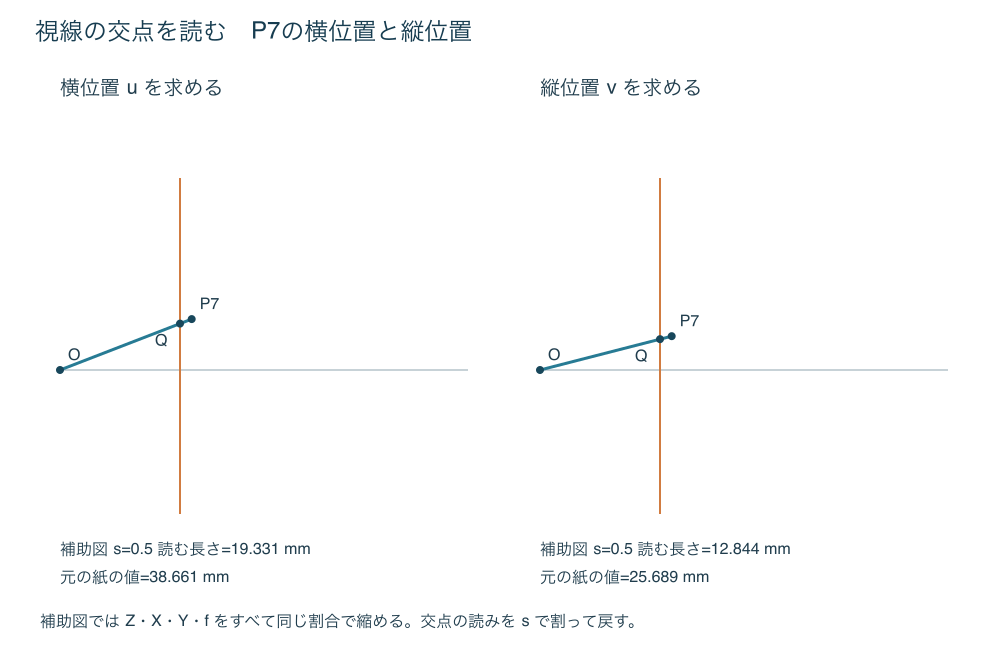

# 二つの補助図で視線と画面の交点を作図する

## 何を行う方法か

各頂点の左右・高さを、二つの相似三角形から読み取る。頂点ごとの奥行きの割算を、直線の交点へ置き換えた基準法である。視点の前方にある任意姿勢の立方体に適用できる。前処理まで図で行う経路と、半辺の計算表を用いる経路を用意する。

点を視線で投影する考え方は[Ruskinの点の作図](../../references/books/ruskin-elements-perspective-point-construction.md)を参照した。以下は原典の記号や図の複製ではなく、視点座標にそろえた独自の構成である。

## 姿勢を図から準備する経路

3半辺をまず(a/2,0,0)、(0,a/2,0)、(0,0,a/2)として描く。次の操作を各半辺に繰り返す。

1. 横X・縦Zの補助平面に端点を取り、原点からの線分を**−α**だけ回す。コンパスで原点から端点までの距離を保ち、分度器で元の線分から角度を取る。端点の横・縦成分を垂線で移す。Yはそのまま。
2. 横Y・縦Zの補助平面で同じことを**＋β**だけ行う。Xはそのまま。
3. 横X・縦Yの補助平面で**＋γ**だけ行う。Zはそのまま。

これらの角度の符号は[入力仕様の回転式](../../research/topics/cube-projection-input-spec.md)と一致する。組になった成分が両方0なら回転しても0なので飛ばす。長さが大きく紙に入らない場合は全半辺を同じ倍率で縮小し、成分を読むときに戻す。三角定規の一方をガイド、もう一方を滑らせて平行・垂直方向を移す。

成分を0.5mm刻みで読み取り、Cとの符号付き加減算で8頂点を作る。ここは長さの読み取り誤差を含む。精度を優先する場合は[円の成分と計算を用いる経路](cube-depth-scale.md)に替えてよい。その場合は純粋な図だけの方法とは記録しない。

## 二つの補助図で交点を求める

1. 8点の最大Zとfを確認する。横幅160mm、正負の縦幅各100mmに収まるよう、縮尺sを1、1/2、1/4…から選ぶ。Z・X・Y・fをすべて同じsで縮める。補助図を一枚ずつ作るので、二枚を横並びにできる大机は要らない。
2. 最初の図は横軸をZ、縦軸をXにする。O=(0,0)を取り、横座標sfを通る垂直線を描く。これが画面の横断線である。
3. 各頂点についてT=(sZ,sX)を打ち、OとTを結ぶ。画面線との交点Qの縦座標を読む。この読みはsuなので、sで割り、mを掛けてuを得る。
4. 二枚目では縦軸をYに替え、T=(sZ,sY)を使う。交点の読みをsで割り、mを掛けてvを得る。
5. 作業表のu・vを本紙へ移し、12辺を結ぶ。紙外なら入力時に決めた共通倍率を見直し、全点を同じ倍率でやり直す。

Z<fの頂点では画面が端点より先にあるため、視線をTの先まで延ばす。Z≤0はこの手順の適用外。X・Yが負なら補助図の横軸の下側に取る。原点から紙の端までの距離と、Zの値を混同しない。

図中のP7は説明用の立体頂点番号で、Qはその補助図で得た交点を表す。画面線と頂点が近くても、同じ点として丸めない。

## 精度と紙面

縮尺sの補助図で読みがδmmずれると、戻した紙上ではmδ/s mmになる。したがって紙に収まる中でできるだけ大きなsを使う。遠い立方体のために長いZを極端に縮めると、かえって不利になる。

その場合は[頂点別計算法](cube-depth-scale.md)へ戻す。補助図の縮小は理想幾何では正確だが、読み取り誤差を抑える保証ではない。[感度検査](../../research/topics/cube-construction-sensitivity.md)では端点・画面線・交点の誤差を工程ごとに加え、この問題を確認した。

## 成立と確認範囲

横の図では三角形の相似からsu/(sf)=sX/(sZ)。縦の図も同様。sを戻すとu=fX/Z、v=fY/Zとなる。姿勢を定める回転も平面内の剛体回転なので、理想作図では長さと直角を保つ。

[記入済み例](../../assets/cube-projection-research/worked-examples.md)には各点の補助図入力sZ・sX・sYと読みsu・svを掲載した。数値検査では有限34条件と200個の追加姿勢で独立基準と照合した。実際に紙へ引く線の精度、人の迷い、所要時間は未測定。
