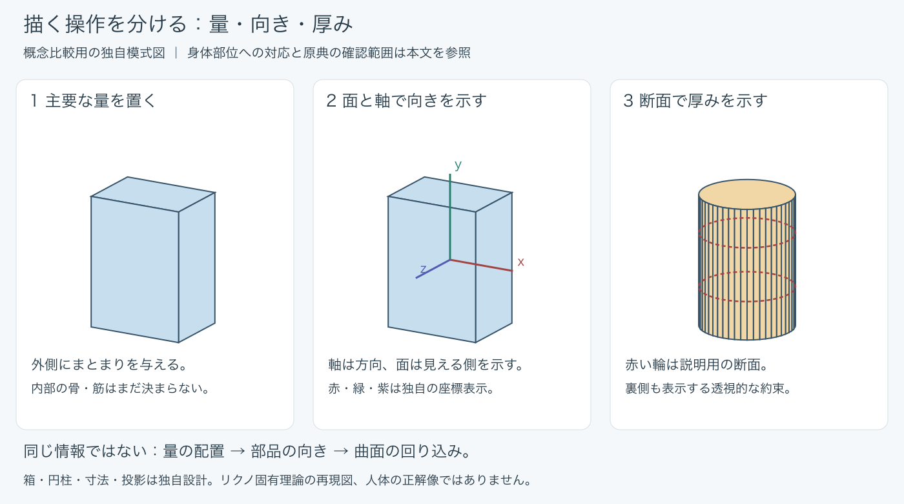
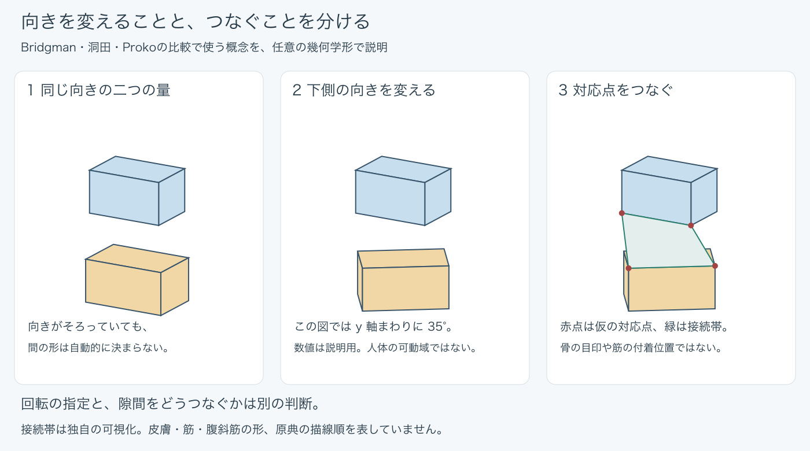
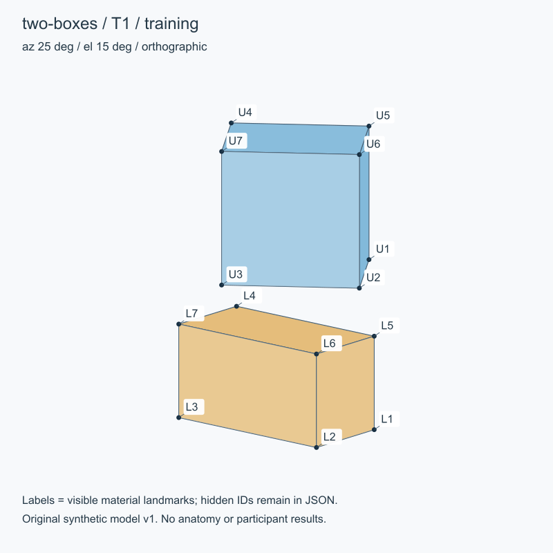

DRAWING PRACTICE LAB · RESEARCH REVIEW

描く力を育てる 練習の設計

有望な練習法、新メソッドの候補、 人が確かめるべきこと

これまでの文献調査・教材比較・幾何学的検査を、 実際に読む人のためにまとめた総合報告書。

2026年10月2日 · 第1版

資料67件・研究文書35件を基盤にした統合。 人による練習効果の実験は未実施。

<!-- TOC -->

# 1　最初に知っておきたい結論 {#conclusion}

## 有望な方法は見つかった。ただし、効果の確定までは進んでいない

今回の調査から、練習をよくするための有望な方向は見つかった。最も優先したいのは、**狙う技能を一つ決め、描いた結果との差を具体的に確かめ、その情報を次の描画に使うこと**である。日を分けた反復、手本を閉じた再生、未見の角度への構築も候補になる。

一方、「この方法なら誰でも短期間で画力が大きく伸びる」「この教材が他より優れている」といえる根拠は得られていない。一般学習の研究、図形を描く実験、人体教材、熟達者の回想は、答えている問いが異なる。これらを組み合わせた新しい練習手順も、組み合わせた時点では仮説である。

<strong>この報告書の中心的な提案</strong> 
「よく見る」「たくさん描く」を、何を見るか・何を残すか・どの差を直すかまで具体化する。そのうえで、直後の出来栄え、後日の保持、別の対象への応用を分けて確かめる。

## 三つの質問への回答

| 質問 | 現時点の回答 |
| --- | --- |
| 効果が高そうな練習はあるか | 目標を絞った描画と具体的な照合を組み合わせる方向が有望。分散・記憶再生も候補だが、人体描画での効果量や最適量は不明 |
| 新メソッドに育てられるか | 育てられる。最も試行準備が進むのは「箱の比率分割＋差の確認」。展開の中心候補は「観察・記憶・別角度を分ける構築練習」 |
| 人の確認はどれくらい必要か | 本書では8つの確認項目に整理した。最初の6項目は1人の予備試行でも部分的に調べられる。人体・作品への妥当性と一般的な優位性には、追加の評価者や参加者が必要 |

「8項目」は人数や8回の作業を意味しない。一つの描画や評価が複数項目に関係する。具体的な作業量を見積もれる既存の箱比率計画は、実描画268分、その他の固定時間42分、合計310分に、評価採点・保存・記録の時間が加わる。描画と保持の評価は約32日、最後の再採点まで最短で約40日を要する予定である。すべて未実施の計画値で、必要最小量ではない。詳しくは第8章で計算の内訳を示す。

# 2　どのような練習を優先するか {#practice}

## 「有望」の意味を三つに分ける

本書では、根拠の強さ、目標との近さ、実行・測定の準備状況を別々に見る。例えば、一般学習で支持が広くても人体描画へは間接的な方法がある。一方、比較効果は不明でも、描く手順を正確に把握し、小さく試せる方法もある。

したがって、以下は効果量のランキングではない。**現在の目的に対して、先に取り入れたり、検証したりする理由が明確な順序**である。

| 候補 | 優先する理由 | 現時点の根拠と限界 |
| --- | --- | --- |
| 技能を絞って描き、差を次へ使う | 課題・結果・修正を結び付けやすい | フィードバック一般の研究と教材手順がある。新しい描画手順の効果は未検証 |
| 練習を日程に分ける | 一度の成功で終わらず、後日の再現を見られる | 一般記憶・一部の運動技能には根拠。描画の最適間隔は不明 |
| 手本を閉じて再生し、照合する | 見えているときだけできる部分を区別できる | 一般的な検索練習、古典の手順、限定的な描画研究がある。模写より優れるとは未確定 |
| 立体を単純化し、別角度へ移す | 輪郭の記憶と構造の使用を分けて調べられる | 構築教材・空間学習が着想源。人体や完成作への転移は未検証 |
| 似た角度・形を比較して混ぜる | 違いを見分けて使う仮説を作れる | 交互練習は課題・評価時点に依存。初めから全面採用する根拠は弱い |

これらの手掛かりは、学習技法のレビュー、フィードバックの集約、保持・交互練習の研究、空間技能の集約にある。[dunlosky-2013-learning-techniques] [wisniewski-2020-feedback] [soderstrom-bjork-2015-learning-versus-performance] [czyz-2024-contextual-interference] [uttal-2013-spatial-training]

## 1回の練習を具体化する例

胸と骨盤の向きを練習する場合、「今日は人体をうまく描く」と置くより、「二つの量を別々の向きとして表す」と置く方が、何を直したいかが明確になる。これは課題を整理する提案で、狭くすれば必ず上達するという実験結果ではない。

1. 対象と観点を決める。今回は二つの箱の方向だけを見る。
2. 参照を見て描く。修正前の出力を保存する。
3. 軸や面の違いを確かめる。「下箱が同じ向きになった」など、次に変えられる言葉にする。
4. 新しい描画で一つの修正を試す。元の絵を直した結果と、描き直せた結果を分ける。
5. 後日、同じ情報条件でもできるかを確認する。別角度への応用は別課題にする。

この流れには時間や反復数を固定していない。既存の正式な箱比率計画を実行する場合は、その計画の時間・順序・評価条件を優先し、途中でこの例を混ぜない。

## 習得を見誤りやすい練習

トレースの正確さは、手本なしの再生能力そのものではない。同じ絵を描き直してよくなることも、新しい題材へ使えることとは違う。手本・グリッド・手順書のどれを利用できたかを記録すると、成果の意味を読み違えにくい。[gonzalez-2011-tracing-copying] [liu-2025-observation-guidance]

参考になる制作実演でも、下書きなし・資料なし・修正なしをそのまま初心者への規則にする理由はない。熟達者の本番と、技能を作った学習過程を分けて考える。作品を見て楽しむ、完成作を作ることも学習の動機や目標になり得るため、狭い測定課題だけで制作全体を置き換える必要はない。

## 今回採用しない強い説明

「一万時間で誰でも熟達する」「学習タイプに合わせれば効率が上がる」「右脳型になれば描ける」は、今回の資料からそのまま採用できる処方ではない。練習時間と熟達の関係には定義・測定・選択の問題がある。好みと効果、教材の神経科学的説明と実際のドリルの効果も分けて評価する。[macnamara-2014-deliberate-practice] [ericsson-2019-practice-definition] [pashler-2008-learning-styles] [nielsen-2013-brain-lateralization]

# 3　研究から分かること、まだ分からないこと {#evidence}

## 根拠の読み方

今回の土台は資料ノート67件で、研究・方法論・論評等38件、実践教材26件、経験談3件からなる。67件の独立した効果実験を行ったという意味ではない。一つのノートに複数の取材をまとめた例もあり、論評やレビューが同じ原著を扱うこともある。

研究は、対象者、描いたもの、比較条件、評価時点、測定方法をそろえて読む。メタ分析で平均的な改善が報告されても、その数値を「キャラ絵が何％うまくなるか」へ換算することはできない。

## フィードバックは内容が重要

教育フィードバックのメタ分析では、効果に大きなばらつきがあり、情報内容などの条件によって結果が異なっていた。これは、目標との違いと次の修正を具体化する設計の手掛かりになる。ただし、一般的な研究から特定講師の添削、AIの助言、今回の数値表示の効果を決めることはできない。情報が多いほど常によい、長い添削ほどよい、という意味でもない。[wisniewski-2020-feedback]

描画課題のNewellらの研究も、目標の情報と描画後の情報を区別する理由になる。ただし今回の確認は要旨中心で、人数・実時間・保持の詳細を設計値へ移せる段階ではない。[newell-1990-drawing-feedback]

## 分散と交互は別の操作

分散は、練習を時間的に分けること。交互は、異なる課題をどの順番で扱うかということ。同じ総時間を一日と複数週に分けた手技研究は、描画の日程を考える間接資料になるが、その分数を絵の必要量にできない。数秒単位の休憩に関する結果も、日をまたぐ描画練習へそのまま移せない。[moulton-2006-distributed-surgical-practice] [gupta-2026-motor-spacing-limits]

交互練習のレビューには、保持時点の得点を見るものと、事前から保持までの変化を見るものがある。対象・選別・測定が違うため、結論が違うからといって単純にどちらかを採用しない。「いろいろな角度を混ぜれば必ずよい」は現段階では強すぎる。[czyz-2024-contextual-interference] [ammar-2024-contextual-interference-gains]

## 描画そのものの研究は、何を試したか

| 研究 | 比較したこと | 今回使える判断 |
| --- | --- | --- |
| Gonzalezほか、2011 | 成人16人の二次元パターンのトレースと模写。両群に記憶再生と照合 | 練習中の正確さ、即時再生、1週後の結果を分ける。記憶練習の有無を単独比較した研究ではない |
| Albaret & Thon、1998 | 成人144人、2～4線分の課題順序。手元の描線を遮蔽し、目標を提示 | 順序と複雑さの関係は指標・試験で異なる。紙面内回転と立体の別視点は別 |
| Likova & Cacciamani、2018 | 視覚障害成人21人。触察後の記憶描画を含む指導と非訓練 | 複合介入の限定的根拠。晴眼者の模写より記憶描画がよいという比較ではない |
| Liuほか、2025 | 観察模写への支援。比較の両条件にグリッド | 支援下の正確さと学習を分ける。少人数の同題材再描画を未見題材への転移としない |

出典と確認水準は巻末の各項目へまとめた。Gonzalez・Albaret・Likovaは指定節の本文確認、Liuは公式概要と検索抽出が中心である。[gonzalez-2011-tracing-copying] [albaret-thon-1998-drawing-schedule] [likova-2018-memory-drawing-transfer] [liu-2025-observation-guidance]

## 原著の細部で、解釈が変わった

Gonzalezの結果解析は複雑なC・Dを対象とし、位置合わせ後の形状差と変換量を分けていた。即時形状の群差を、全指標の明確な模写優位と読むのも適切ではない。1週後の群差が有意でないことは、両方法の同等性の証明ではない。試行数の対応に残る曖昧さから、練習回数の推奨は作っていない。

Albaretでは、実験者が端点を指定し、最初の2線分だけを測っていた。「全図形を自動採点した研究」とは読めない。Likovaの前後各3時間は触覚認知の評価時間で、指導の2時間×5回とは別である。一部の人の後日評価も、全員の描画保持ではない。

これらは方法の価値を否定する話ではない。**何が測られたのかを合わせて初めて、自分の目標へ使える根拠になる**ということである。

## よく描けるようになることと、別の能力へ移ること

観察描画の授業を追跡したKatzやChamberlainの研究は、実際の教育を扱う資料として重要である。ただし非無作為比較や対照群のない追跡から、個別教材の因果効果を分離できない。16週間や5か月という期間も、必要最小期間ではない。[katz-2021-observational-drawing] [chamberlain-2021-drawing-longitudinal]

高齢成人を対象にしたVodyanykらの予備研究では、日程の自己選択、脱落、採点方法の制約が残る。描画の総合評定と幾何学的な角度指標は同じ結果にならず、ある点数の改善を「全ての描画技能の改善」とすることはできない。[vodyanyk-2025-drawing-feasibility]

空間技能の訓練には集約された根拠があるが、空間課題への転移と魅力ある人物画への転移は違う。また、運動困難を持つ児童での3D追跡から2D図形模写への転移例は、成人の人体構築を直接証明しない。[uttal-2013-spatial-training] [snapp-childs-2016-drawing-transfer]

# 4　人体を単純化する方法から得られたこと {#construction}

## 箱や円柱は、何を残すために使うのか

今回の比較では、単純化の操作を五つに整理した。これは各著者に共通する正式理論ではなく、読む側が違いをつかむための分類である。

| 操作 | 注目すること | 省かれやすいこと |
| --- | --- | --- |
| 主要な量 | 頭・胸・骨盤などのまとまりと配置 | 細かな輪郭、筋の詳細 |
| 面と軸 | どちらを向くか、二つの部分の相対方向 | 曲面の細かな変化 |
| 断面と曲面 | 厚みと回り込み | 個々の骨・筋の位置 |
| 骨の目印 | 抽象形を観察した身体へ結び直す位置 | 全骨格の詳細 |
| 接続と変形 | 部分同士の間隔、圧縮、伸び、つながり | 個体差を含む表面の全情報 |

<figure>

<figcaption>図1　量・方向・厚みは異なる情報。独自の幾何学図であり、人体の正解図や固有理論の再現図ではない。</figcaption>
</figure>

この分け方を使うと、「箱を描けない」という困りごとを、形の配置、向き、厚みのどこで迷うかへ分けて考えられる。ただし図だけで原因を診断できるわけではなく、実際にどこでつまずくかは人の試行で確かめる。

## 洞田、Proko、Bridgmanは同じ箱ではない

洞田式は、基準箱から補助形を作り、位置や比率を変えながら構築する工程を追える点が強みである。第3回の胸の基準箱と下へ延ばす補助箱は、そのまま二つの身体部位の完成形ではない。第7回では相対回転や傾き、くびれなどへ進む。全15回の本文と選んだ30図を確認したが、全図の実作図や独立した効果比較は行っていない。[toda-kobun-method]

ProkoのRobo Beanは、胸郭と肩の一部、骨盤と臀部を含む量を、面や目印で扱う。箱の角はすべて骨の角という意味ではない。個体の比率差と、前後・側面で異なる重なりにも注意が必要である。洞田の補助箱の比率を移して共通の正解にすることはできない。[proko-robo-bean-and-obliques]

Bridgmanは量と接合を考える歴史的な教材として使える。本文とConstructionの図版から傾き・ねじれ・接続を読むことはできるが、図だけから筆順や一定の寸法を決めてはいけない。現代教材と操作が似ていても、影響関係や学習効果まで同じとは限らない。[bridgman-1920-constructive-anatomy]

<figure>

<figcaption>図2　方向の指定と接続の指定を分けた独自図。35度は説明値。緑の帯と赤点は筋・皮膚・骨の位置を表さない。</figcaption>
</figure>

## リクノの理論は、どこまで分かったか {.new-page}

公開序章では、線数と表現される情報量を分け、頭・胴・腰などの土台や部位の向きを整える考え方が確認できた。ここからは、「線を足したか」より「その線で何が読み取れるようになったか」を問いにする発想が得られる。[rikuno-2015-line-design]

出版社の見本6頁には、観察と線への置換、眼球の向き、胴体・衣服への応用などがある。一方、**いもむし理論・箱パース理論・線画裏立体把握の各定義と手順全体は未確認**である。p.108の応用例が読めたことを、いもむし理論全体の解明とはしない。第2巻も公式紹介と目次の確認が中心である。[rikuno-2016-character-design]

今回育てたい案は「線の役割を説明して修正する」ことであり、リクノ本人が検証した新しい練習法と帰属させない。キャラクターとして見せたい形を優先する例外もあるため、「厳密パースだけを守ればよい」という要約も避ける。

## 骨と筋は、三つの知識を分ける

形をどのように省略して描くか、何とつながりどう作用するか、その動作で表面がどう見えるかは別の問いである。筋名の暗記だけでも、表面の輪郭の暗記だけでも、全てが自動的に解決するわけではない。

Prokoの腹斜筋の公開説明は接続・作用を読む入口になり、レオナルドの編訳史料には動きに応じた筋の扱いがある。ただし本調査は全筋の現代解剖学的照合を行ったものではない。新メソッドに人体の正誤を含める段階では、目印・部位・動作の妥当性を別に確かめる。[proko-robo-bean-and-obliques] [leonardo-memory-and-functional-anatomy]

Hamptonは公式の構成・目次・正誤表、Vilppuは講座シラバスまでを確認した。球・箱・円柱や、動きから形と量へ進む構成を調べる入口にはなるが、本文や講義全体を履修済みの解説ではない。[hampton-figure-design-invention] [vilppu-figure-construction]

# 5　熟達した作家と古典から得た着想 {#artists}

## 見事な本番と、技能を作った過程を区別する

Kim Jung Gi、寺田克也、吉成曜の調査では、本人の取材に基づく学習の特徴を整理できた。ただし3人は今回指定された事例であり、熟達者全体の代表標本でも、技術の原因を分離できる比較実験でもない。

| 作家 | 本人の回想から拾える特徴 | 練習設計へ移すなら |
| --- | --- | --- |
| Kim Jung Gi | 関心の強い物を複数方向から観察し、立体的な形として使う。必要に応じて資料も使う | 同じ対象を別方向から見るとき、何が新しく必要になるかを記録する |
| 寺田克也 | 部品の配置・材質・機能を見て、頭の中でも形を取る | 外形だけでなく、接続箇所や動く仕組みを説明してから描く |
| 吉成曜 | 作画担当者を意識した鑑賞、兄の仕事を手伝った経験 | 好きな表現のどの判断を学ぶのかを定め、小さな制作工程で試す |

この右列は本書の応用案である。吉成曜がKimや寺田と同じ記憶描画練習をしていたとする資料は得られていない。寺田の制作談には下絵やデジタル修正もあり、修正の禁止を本人の普遍的な規則にできない。[kim-jung-gi-learning-interviews] [terada-katsuya-learning-interviews] [yoshinari-you-learning-interviews]

## 言葉を練習へ変えるときの注意

「見る訓練」という言葉だけでは、実際に何をするかは決まらない。靴の立体を覚える、蝶番の仕組みを理解する、アニメの表現を担当者と結び付ける、という具体的な違いまで残す必要がある。

回想から総練習量や才能と環境の割合は分からない。本章は要約であり、初出不明の転載、未照合の訳・原音による発言を、確定した名言として載せていない。

## 古典にも、記憶と修正の具体的な手順がある

レオナルドの手稿編訳の項目531には、手本なしで描いて重ね合わせ、差を確かめる手順がある。動作を簡略な線で記録する提案や、動作に応じた筋の扱いもあり、古典を精密模写だけの教えとするのは不正確である。[leonardo-memory-and-functional-anatomy]

Harold Speedは、観察した印象を描画に戻せる線・明暗の関係として分析し、記憶から描くことを勧める。Bridgmanは量と接合、Bargueは図版を使う段階的模写というように、古典の中にも異なる目的がある。[speed-1913-visual-memory] [bridgman-1920-constructive-anatomy] [bargue-drawing-course]

古典から得られるのは手順や観点であり、歴史の長さは効果の保証ではない。翻訳・編集と原文を分け、Lecoqの原著やDürer等の未取得原典を読了扱いにしない。

# 6　新メソッドに育てたい四つの候補 {#methods}

## まずは一つの小さな核を作る

候補は四つに整理した。名称は内容を説明するための仮称で、世界初の発明や有効性の認定を意味しない。既存の手順や研究を、対象・入力・出力・照合の仕方が追える形へ組み直すことが開発の中心になる。

| 候補 | 狙い | 準備状況 | 開発上の優先度 |
| --- | --- | --- | --- |
| M1　比率を分けて、差を次へ使う | 限定した高さ比の再現 | メソッド・ドリル・個人内試行計画・道具がある。人の試行は未実施 | 最初の実行可能性確認に向く |
| M2　観察・記憶・別角度を分けて構築する | 見える像の再現と構造の利用を区別 | A/B/C仕様、2モデル12視点、座標と計算検査がある | 発展の中心候補 |
| M3　線の役割と接続を説明して描く | 何を表す線か、部分がどうつながるかを意識する | 教材・作家の発言に着想。単独の試行手順は未整備 | M2の後に要素比較として試す |
| M4　修正した理由を別の制作へ運ぶ | 部分練習を新しいポーズ・作品へつなぐ | 作品課題と評定基準は未設計 | 人の評価を含む後続段階 |

## M1　比率を分けて、差を次へ使う

対象は正面・平行投影の上下二箱である。上箱の高さを4区間として考え、下箱をその3区間にする。描いた後に高さ比を測り、長すぎるか短すぎるかを確かめ、新しい描画へ反映する。

この候補の良さは、狙う関係と観測できる誤差が狭く明確なことにある。洞田教材の一部を2D課題へ切り出した独自案なので、洞田式全体の効果や人体の自然さは評価しない。0.75はこの課題の指定値であり、人の骨盤や全身に普遍的な比率ではない。[toda-kobun-method]

検証したいのは、通常模写の前値に比べて誤差が変わり、後日もその変化が残るかということ。現在の計画は比率分割と数値フィードバックを束ねた前後比較なので、どちらが効いたか、グリッド模写より優れるかは分離できない。

測定不能な線が多い、再採点が一致しない、初めから誤差が小さすぎる、日ごとの揺れが大きい場合は、練習に進む前に止める条件がある。「まず実施して、都合のよい点だけ見る」案にはしていない。個人内で有望でも、一般向けの推奨へ進むには別の比較と反復が必要である。

## M2　観察・記憶・別角度を分けて構築する {.new-page}

この候補は、三つの課題を必ず一続きに実施する訓練法として確定したものではない。まず結果を読み分ける枠組みであり、そこから練習の組み合わせを調べる。

| 課題 | 何を見せるか | 何を確かめるか |
| --- | --- | --- |
| A　参照あり | 目標画像を表示 | 見える配置を構築できるか |
| B　同一視点の再生 | 観察後に参照と以前の描画を閉じる | 同じ見え方を再生できるか |
| C　別角度への構築 | モデル定義とカメラ条件を表示。目標画像は隠す | 定義した立体を未提示視点へ投影できるか |

例えばAはできるがBで崩れる場合、参照がなくなると難しいことは分かる。しかし記憶力だけが原因とはいえない。観察の仕方、理解、運筆も関わる。BはできてもCが難しい場合も、暗記だけで描いたと即断せず、モデルや投影の理解を調べる必要がある。

構築対象として、上下二箱と箱に円柱を接続した形を用意した。各6視点のうち3つを練習、3つを評価へ分けている。円柱は24角柱近似、投影は平行投影で、人体の正解ではない。この限定によって、少なくとも素材の正解座標を計算で定められる。

<figure class="small-figure">

<figcaption>図3　正解座標を定めた合成素材の一例。IDはモデル上の固定点を表し、骨の名前や身体の目印ではない。</figcaption>
</figure>

練習法として効果を比べるなら、A中心とBを加える条件で、両者に共通の評価を用意する。観察時間・描画時間・照合時間・題材への曝露も記録する。単にAの得点とBの得点を比べても、課題が違うため、方法の優劣の証明にはならない。[gonzalez-2011-tracing-copying] [likova-2018-memory-drawing-transfer]

## M3　線の役割と接続を説明して描く {.new-page}

狙いは、「形に似た線を増やす」段階から、線が何を表すかを選ぶ段階へ進めるかを調べること。胸の向き、曲面の回り込み、部品の接続など、今回の線で表したい一つの関係を言葉にしてから描き、描いた後にも対応を確認する。

リクノの線と情報の考え方、寺田の機能や接続を観察する回想、Bridgmanの量と接合が着想源になる。ただし、それらが同じ機序を実証しているわけではない。[rikuno-2015-line-design] [terada-katsuya-learning-interviews] [bridgman-1920-constructive-anatomy]

言葉で説明する工程は負担を増やす可能性もある。描く時間が減る、言葉は正しくても線に移せない、特定の用語に慣れた人だけ有利になる、といった失敗も想定する。通常の観察と比べるなら、時間と指示の差を明示し、新しい課題で改善が残るかを見る。

## M4　修正した理由を別の制作へ運ぶ

部分練習の点数だけで終わらせず、修正した関係を、別のポーズや小さな制作課題へ使う案である。「腰の向きを変えた」「腕の接続を見直した」など、何を変えたかを一つ残し、新しい条件でも使えるかを見る。

これは作家の制作経験や、目標との比較・弱点練習を扱う教材から得た独自案である。吉成曜本人の具体的な反復メニューではない。[yoshinari-you-learning-interviews] [saito-2022-fast-improvement]

この段階では、位置の誤差だけでは足りない。意図した動作が伝わるか、同じキャラクターに見えるか、構造が不自然でないかを、人が目的に応じて評価する必要がある。魅力・好み・正確さを無根拠に一つの総合点へまとめず、評価したい用途を先に決める。

# 7　自動検査で確かめられたこと {#validation}

## 計算が正しいことと、学習に役立つことは別

今回は、既知の合成座標を用いた測定処理と素材の検査を行った。位置・軸方向・比率について、意図的に変えた入力が期待どおりの値になるかを調べた。これは人が描いた絵の採点ではない。

| 整備したもの | 確認できたこと | まだ確認していないこと |
| --- | --- | --- |
| 7文書の70主張の台帳 | 出典・箇所・確認範囲・制約を追える | 全原典の全文精読、全主張の外部査読 |
| 操作比較の独自図2点 | 量・軸・断面、向きと接続の説明と表示 | 人の理解しやすさ、人体としての正解 |
| 2モデル・12視点 | 寸法・カメラ・点ID・正解座標、練習と評価の分離 | 初心者に適切な難易度、人体への転移 |
| 測定の11検査 | 既知の変形、欠測、ゼロ長、非数値、ID不一致等の扱い | 手描き画像からの目印抽出、人の採点との一致 |
| 素材の前後・境界検査 | 全頂点の画像内配置、9,785サンプルの面の前後 | 任意の追加モデルの全画素を保証すること |
| 68生成ファイルの再生成 | 同環境で同じファイルを作れる | 環境をまたぐ表示の完全一致、練習効果 |

検査時には下端の余白不足を見つけ、縮尺と配置を修正した。異常入力を見逃さないことや素材を再生成できることは、後続の人の試行を整えるための成果である。

## 位置合わせをすると、誤りが消える

例えば、形をそのまま5単位ずらした入力は、元の位置で比べれば誤差がある。しかし位置を合わせてから比べれば0にできる。同様に、回転や一様な拡大縮小を許すと、それらの違いが消える。

| 元の違い | 補正後に起こること | どう使い分けるか |
| --- | --- | --- |
| 場所が違う | 平行移動で消せる | 配置を評価するなら元の位置を残す |
| 向きが違う | 回転で消せる | 方向を評価するなら回転差も別に測る |
| 大きさが違う | 一様尺度の変更で消せる | 寸法を評価するなら尺度差を残す |
| 一部だけ伸びる | 一様尺度では全ては消せない | 局所の比率や形の違いを見る |

今回の測定は対応するID付きの点が入力されることを前提とする。人の線からどこを点として選ぶかは、その前段にある別の判断である。AIが目印を選べたとしても、それだけで妥当な正解になるわけではない。

# 8　人による確認は、どれだけ残っているか {#human}

## 「確認待ち」と「効果を知るための実測」を分ける

文献整理・図解・幾何学素材・計算検査の整備を進めるうえで、人の承認や資料提供を待つ必須項目は残していない。これは、効果がすでに確認されたという意味ではない。**人に効くか、人が使えるかを知る部分は、人の行動と結果を観察する必要がある。**

以下では、人の確認を8つの作業項目に整理した。すべての候補に8つの別実験を一律に課すという意味ではなく、結論をどこまで広げるかに応じて必要な確認を示す一覧である。

| ID | 確認すること | 人が行うこと・記録 | 必要になる段階 |
| --- | --- | --- | --- |
| H1 | 手順と操作を理解できるか | 指示を読んで試行し、迷い・保存失敗・疲労・実時間を記録 | 最初の試行 |
| H2 | 同じ絵を安定して測れるか | 端点・最終輪郭を選び、同じ作品を再採点する | 効果の判定前 |
| H3 | 普段の作画の揺れはどれくらいか | 条件をそろえ、複数日に描く | 前後差を読む前 |
| H4 | 練習直後に変化するか | 事前と同じ情報条件の課題を実施 | 個人内の兆候を調べる |
| H5 | 時間を置いても残るか | 規定の間隔で、補助条件をそろえて描く | 保持を述べる |
| H6 | 未練習の題材・配置へ使えるか | 評価用に残した題材を描く | 近い転移を述べる |
| H7 | 人体・作品で意味のある改善か | 構造の妥当性や意図の伝達を、人が目的別に評価 | 人体・完成作へ広げる |
| H8 | 比較方法より有効か、誰に適するか | 比較条件・割付・複数の対象者や反復で調べる | 因果効果・一般化を述べる |

H1～H6は1人の予備試行でも、その人について部分的な情報を得られる。自己採点では見た絵の記憶が残り、完全な盲検にはならない。H7では解剖や構築に詳しい評価者と、意図の伝達を受け取る読者では役割が違う。H8の参加者数・採点者数はまだ決められず、目的、測定精度、比較したい差、利用できる資源から計画する。[koo-li-2016-rating-reliability] [lakens-2022-sample-size] [wwc-2022-single-case-standards]

## 既存の箱比率計画に限れば、作業量を数えられる {.new-page}

現在ある計画は、成人1人を想定した任意の自己試行で、開始日は未定である。次の値は完遂した場合の予定量であり、途中のゲートで終了すれば少なくなる。推奨される最低練習量ではない。

| 作業 | 算出 | 予定量 |
| --- | --- | --- |
| 練習の実描画 | 1回20分×8回、各5枚 | 160分・40枚 |
| 評価の実描画 | 1枚4分×27枚 | 108分・27枚 |
| 説明と練習内の測定 | 説明2分＋測定3分を8回 | 40分 |
| 装置への慣れ | 題材外の線・丸 | 2分 |
| 固定時間の合計 | 160＋108＋40＋2 | **310分＝5時間10分** |
| 評価採点 | 評価画像27枚を2回ずつ | **54画像回**。時間は未測定 |
| 保存・匿名化・実施記録 | 条件・欠測・逸脱も保存 | 時間は未測定 |

実描画は練習と評価で計67枚・268分となる。評価採点54画像回は、54枚の別作品でも54人でもない。練習中に最後の1枚を測る8回は、表の40分に含まれており、評価採点54回と区別する。

試行はD1～D3の事前描画、D10の再採点、D11～D25の8練習回、最終練習から48時間後と7日後の評価を含む。描画と保持評価は約32日。後段の初回採点をD33に行い、7日後に再採点するなら最短でD40頃までかかる。これは予定を日付へ展開した計算で、実施時間の測定ではない。

## 最初に人が確かめるのは、上達より前の問題

既存計画では、最初に同じ絵の端点を安定して選べるかを調べる。標準課題の事前9枚が両回測れ、再採点の比率差が規定値以内なら先へ進む。規則がうまく使えないときは、その版を終了して測定手順を直す。

このため、「1人の小さな試行」といっても、いきなり8回の訓練全体を完遂する必要があるとは限らない。最初の人の作業はH1～H3を中心に、使える手順・測れる出力・判別できる変動かを確かめるものになる。

既存の暫定値は、再採点差0.02、改善幅0.05である。どちらも設計者が置いた運用値で、研究で定まった知覚閾値や最小検出変化量ではない。結果を見てこの版の閾値を下げることはしない。見直すなら次の別計画として残す。 箱比率の絶対差と、新素材の絶対対数比率差は別の尺度なので、0.05を移せない。計算の許容差1e-10も技能の合格値ではない。

## 人数・時間がまだ数えられない部分

M2は時間・反復数・保持間隔・合格閾値が未設定で、M1の310分を流用できない。M3・M4は指示と比較条件、作品の評価基準から設計する必要がある。どの候補もH1～H8の必要部分は未実施であり、人の理解・負担・意図の伝達をAIの判断だけで検証済みにしない。

# 9　次に育てる順序と、採用の判断 {#next}

## 最初の優先順位

**実行可能性を最初に知りたいならM1、人体構築へ広がる研究の中心を育てたいならM2**という二つの役割を分けるとよい。M1が狭い課題でうまくいっても、M2が有効と自動的に決まるわけではない。

まずM1の測定・操作に関するゲートを、人の実データで確認する。その後に実行可能な範囲で個人内の変化を調べる。M2では、時間・参照・ID入力などの人向けの手順を実施版へ落とし、観察・再生・別角度のどこを練習条件として比較するかを一つ選ぶ。

M3の言語化とM4の制作への応用は、前の段階が扱いやすくなってから加える。最初から比率分割・記憶・多視点・言語化・分散・交互練習を同時に導入すると、改善してもどこが役立ったか分からなくなる。

## 人を待たずに続けられること

人の効果確認を待つ間にも、進められる整備はある。M2の説明文や入力画面を作り、同じ条件で再実行できるようにする。答えを見ない出題の仕組みを整える。異常入力や追加視点でコードを点検する。公開資料に新しい正規経路が見つかったときだけ、保留原典を再確認する。

ただし、素材やテストケースを増やし続けても、人にとっての難しさや練習効果は埋まらない。自動整備をどこまで行ったら人の予備試行へ渡すかを、成果物で区切ることが重要である。

## 「使える案」と「効果を支持された方法」の境界

| 段階 | 判断できること | 次へ進むための情報 |
| --- | --- | --- |
| 手順・素材が揃う | 同じ条件を作れる | 人が理解し操作できるか |
| 予備試行ができる | 実行可能性、測定の問題、負担 | 別日の変動、評価の精度 |
| 個人内の変化が見える | その人・条件での変化の兆候 | 保持、近い転移、代替説明 |
| 条件を限って採用する | 明示した用途で使う判断 | 失敗・悪化・他の人や題材での反復 |
| 一般向けに推奨する | 対象範囲と比較上の利点 | 適切な比較設計と一般化の根拠 |

リポジトリの `stable` は、対象と条件を明記して採用する運用上の状態である。普遍的な科学的証明を意味しない。現在のメソッドは `draft` のままで、好結果を予想して先に昇格させない。

## 人体構築以外の範囲

| 領域 | 今回得た手掛かり | 先に必要な確認 |
| --- | --- | --- |
| 線・パース | 予行、辺の延長、投影による整合の確認 | 新しい形での正確さと負担。教材一式の独立効果は未確認 |
| ジェスチャー・表情 | 動線、シルエット、眉・目・口の関係 | 意図を伏せても動作や感情が伝わるか |
| 同一性・デザイン | 比率や形を変えても同じ人物・設定に見えるかという問い | 好みと識別を分けた受け手評価 |
| 手・足・衣服 | 部位の分解、支持点、張力などの教材上の観点 | 図版・動作・構造の妥当性と、角度を変えた実描画 |
| 構図・明暗・色 | 焦点、明度、色域を整理する手順 | 注視・調和・好み・完成作の目的を分けた評価 |
| 制作管理 | 目標作との比較、弱点を絞る、短い単元 | 継続性と作品への効果。完成枚数だけで判断しない |

これらの領域を効果が低いとして除外したわけではない。今回の重点技能比較では、独立した訓練効果や保持の根拠が不足したため、最初に試す対象を限定した。方法の詳細・確認水準は巻末の教材資料へ戻れる。

# 10　用語と、資料へ戻るための案内 {#guide}

## よく使う言葉

| 用語 | 本書での意味 |
| --- | --- |
| 遂行 | その場の条件でできたこと。手本や補助の利用も含む |
| 保持 | 時間を置いた後にもできること。間の練習や再テストの影響を記録する |
| 転移 | 練習していない題材や条件へ使えること。どこまで違う条件かを名指す |
| 分散 | 練習する時点・日程を分けること |
| 交互練習 | 異なる課題を混ぜる順序で練習すること |
| フィードバック | 結果と目標の違いについての情報。褒め言葉、点数、修正指示は別の内容 |
| 信頼性 | 同じ対象を繰り返し測るなどしたときの安定性 |
| 妥当性 | 測定値が、判断したい技能を適切に表すかということ |
| 合成データ | 決めた規則・モデルから作った値。人の実測結果ではない |
| ランドマーク | 対応付ける位置の手掛かり。骨の目印と幾何学の点IDは同一ではない |

## 保存資料の地図

以下のパスは、この報告書を作成したリポジトリ内の保存場所である。PDFだけを読んでも結論と根拠の限界が分かるように、必要な内容は本文にも記載した。

| 読みたいもの | リポジトリ内の保存先 |
| --- | --- |
| 疑問から読む入口 | `docs/drawing-research-reading-guide.md` |
| 70主張と出典・条件 | `research/comparisons/drawing-claim-ledger.md` |
| 操作別の人体比較 | `research/comparisons/figure-abstraction-operations.md` |
| 観察・記憶の研究 | `research/learning-science/observation-memory-feedback.md` |
| 作家の学習歴 | `research/topics/master-artists-learning-paths.md` |
| 合成データの検査 | `research/learning-science/geometric-measurement-checks.md` |
| 2モデル・12視点の素材 | `assets/construction-geometry/README.md` |
| M1の試行計画 | `experiments/2026-10-02_torso-ratio-pilot.md` |
| M2のA/B/C仕様 | `methods/drafts/torso-observation-memory-task-spec.md` |
| 全資料の索引 | `references/README.md` |

# 付録　出典と確認範囲 {#sources}

本文の［R番号］から該当資料へ移動できる。各項目の「原典・公開先」は外部リンクで、資料名は保存ノートの題名を用いた要約見出し。原著の正式題名・版・節・頁などはノート本文に記録している。

「指定節」は必要な本文の一部を確認した意味であり、全文精読ではない。「検索抽出」「要旨」「公式紹介」も信頼度の点数ではなく、実際に読めた範囲を表す。複数研究を統合した資料と、手順の教材、個人の経験談を区別する。新たな図はすべてリポジトリの独自図で、外部教材の転載ではない。

## この報告書の編集範囲

2026年10月2日までに保存した資料67件、研究文書35件、二つのメソッド草案、ドリル・実施計画・素材・検査結果を統合した。すべての原典を全文再取得して再解析したレビューではない。人の描画・採点・負担のデータは作成していない。仮称M1～M4とH1～H8の整理は本報告書の編集上の提案である。

PDF作成時にはフィードバックの出版社本文を再確認した。空間技能のPubMed、児童の転移と高齢成人の描画研究のPMCは、この回の取得では本文を得られず、保存済みの確認記録を継承した。取得できたことに置き換えていない。資料の確認水準は次の一覧に示す。

## 資料67件の一覧

<!-- REFERENCES -->
