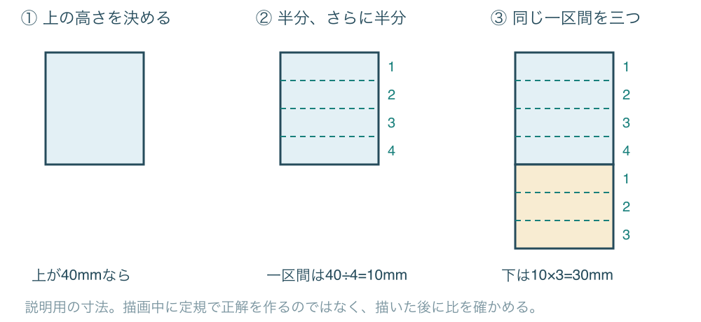
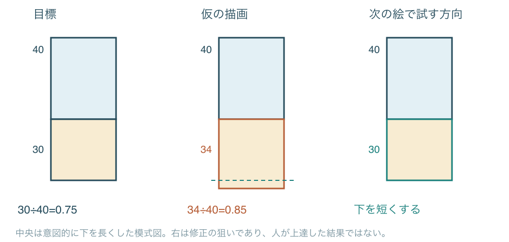
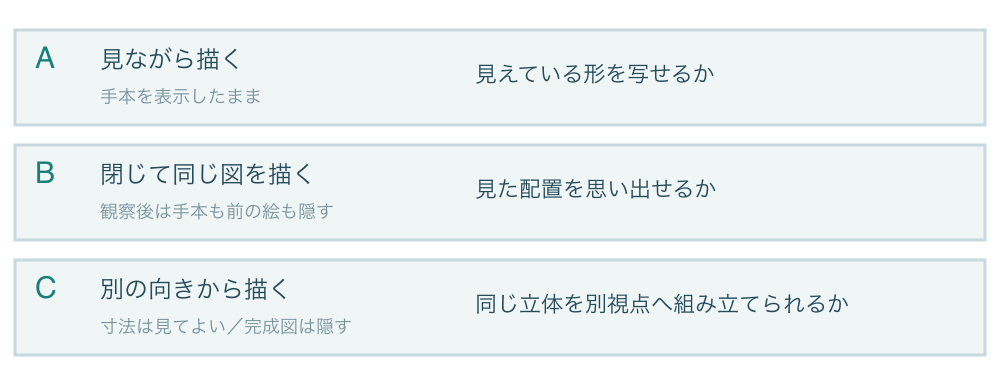
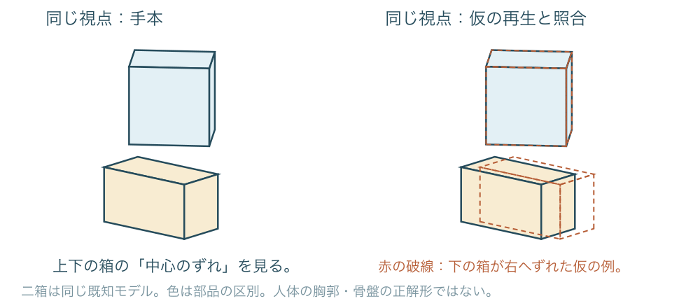
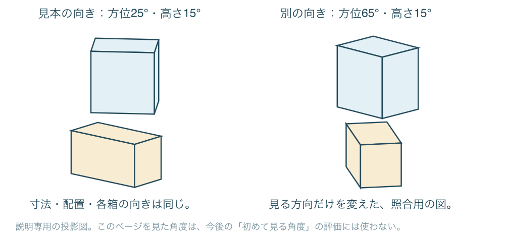
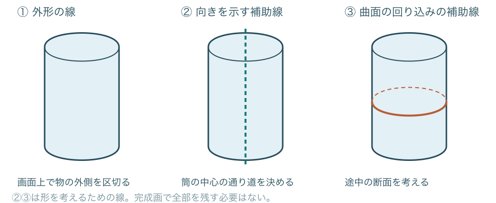
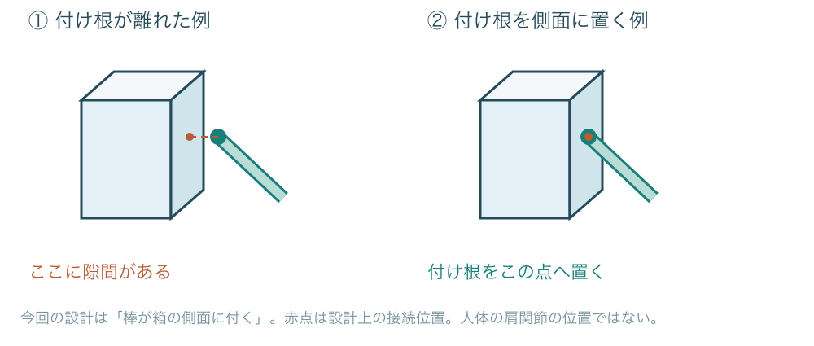
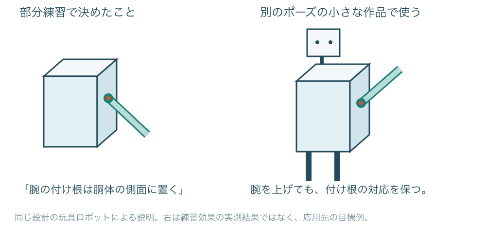

# 新メソッド候補を、目的と作図から理解する

**四つの案を、目的・手順・作図例から読み直す**  
2026年10月3日／説明用の別冊

元の報告書『描く力を育てる練習の設計』の第6章（12〜14ページ）で挙げた四つの候補を、具体例で説明します。まず押さえたいのは、**四つとも「描き方の万能な新技法」ではなく、練習の組み立て方を考える案だということ**です。

元の説明は研究上の用語が多く、「何のためにその操作をするのか」が伝わりにくくなっていました。本書では、M1〜M4を次の短い名前で呼びます。元の報告書との対応を保つため、番号も残します。

| 候補と本書での呼び名 | 目指す変化を一言でいうと |
| --- | --- |
| M1　比べて、次の一枚で直す | 「下が何となく長い」を「上に対して下が長いので、次は短くする」に変える |
| M2　見て描く・思い出す・別方向を分ける | 「描けた／描けない」を、どの条件なら描けるかに分けて把握する |
| M3　線の意味を決めて描く | 「それらしい線を足す」を「向きやつながりを示すために線を選ぶ」に変える |
| M4　直した考え方を別の絵で使う | 「同じ絵なら直せた」から「違うポーズでも、その考え方を使えた」へ進むことを狙う |

**M1は具体的な練習案、M2は課題を分ける枠組み、M3・M4はまだ手順を育てている案です。** 必ずM1→M2→M3→M4の順に行う講座ではありません。自分が確かめたいことに合う一つを選びます。

本書の作図は、意味を説明するために作った図です。「修正前」「修正の狙い」を示す図も、人が練習して上達した実績ではありません。既存の正式な実験計画、練習時間、採点条件は変更していません。

## 1　M1：上下の長さを、狙った割合で描けるようにしたい

### どんな困りごとを扱うのか

上と下に二つの箱を描いたとき、下だけ長くなったり、短くなったりする。描き直しても、毎回どのくらい変えればよいか分からない。M1は、このような**二つの長さの関係をそろえる**ための練習案です。

ここでは、正面から見た箱を二つの長方形として描きます。上の高さを4とすると下は3、つまり下の高さは上の0.75倍、という課題に限定します。横幅や線の美しさより、まずこの高さの関係を見ます。



### 紙の上で何をするのか

1. 上の長方形を描き、その高さを目で二等分します。さらに、それぞれを二等分し、四つの同じ高さの区間として考えます。
2. その一区間を物差し代わりにして、下の長方形を三区間ぶんの高さで描きます。上と下は同じ幅で、境界を共有させます。
3. 描き終えてから、上と下の高さを測ります。下が長いか短いかを確かめ、次の一枚に反映します。

例えば上が40mmなら、一区間は10mm、下の目標は30mmです。これは仕組みを説明するための数値で、毎回40mmに固定する必要はありません。

**目指すのは、補助線や数値を使っている最中だけ正しくなることに加え、補助を外した後にも割合を再現しやすくなることです。** そうなるかは、まだ人の試行で確認していません。

0.75はこの練習図の指定値です。骨盤や人体の自然な比率を0.75にする規則ではありません。奥行きや傾きのある箱へ、この画面上の長さ比をそのまま当てはめることもできません。

## 2　M1：どこを直せばよいかを、次の一枚へ渡す

### 「長い気がする」を、方向のある修正へ変える

仮に、描いた上の高さが40mm、下が34mmだったとします。次の計算で、下がどれだけ長いかが分かります。

```text
描いた比率 = 下の高さ ÷ 上の高さ = 34 ÷ 40 = 0.85
目標との比率差 = 0.85 − 0.75 = ＋0.10
この上の高さに対する下の目標 = 40 × 0.75 = 30mm
```

比率差の＋0.10にはmmを付けません。高さの差でいうなら、下が34−30=4mm長い状態です。「10％長い」と言い換えると何に対する割合かが曖昧になるため、本書では比率差とmm差を分けます。



元の絵を残し、「次は下の高さを短くする」と一つ書きます。それから新しい場所へ描き直します。同じ輪郭を消して整えるだけで終えず、次の描画でも関係を作れるかを見るためです。次の上が44mmになったら、下の目標は33mmです。前の30mmを機械的に写すのではありません。

### 何を確かめればよいか

| 見る結果 | 分かる範囲 |
| --- | --- |
| 今の絵を直すと比率が近づいた | 指摘を見ながら、その絵を修正できた |
| 次の一枚でも比率が近づいた | 今回の修正を、新しい描画へ反映できた兆候 |
| 後日、同じ参照条件でも近い比率を描けた | 時間を置いても再現できた兆候。日ごとの変動も確かめる |

この頁は数値の読み方の説明です。正式なM1の試行は、PC上で定規・グリッド・自動補正を使わず描き、描画後に定めた6点で測る別の仕様です。紙の図で仕組みを理解した記録を、その実験の結果へ混ぜません。比率分割と数値の確認を一緒に使う案なので、どちらだけが役立ったかもまだ分かりません。

## 3　M2：「描ける」を三つに分けて確かめたい

### 手本があると描けることと、手本なしで描けることは違う

手本を見ながらなら描けるのに、閉じると配置が変わる。正面は描けるのに、斜めから描こうとすると形が分からなくなる。この二つを、まとめて「立体を理解していない」と決めつけると、何を練習すればよいかが曖昧になります。

M2では、見てよい情報を変えた三種類の課題を用意します。目指すのは、**どの条件で何が難しくなるのかを把握し、次の練習の狙いを絞れるようにすること**です。



A・B・Cは難易度順の級や、必ず続けて行う三段階ではありません。とくにBを試す前にAで何度も描くと、観察だけの場合とは条件が変わります。現在のBの仕様では、まず見るだけにし、その後に手本を閉じて描きます。

例えばAで上下の箱の位置が合い、Bでは下の箱がずれたなら、「手本を閉じた条件では位置を再現しにくかった」と記録できます。しかし、記憶力だけが原因だとは断定できません。観察の仕方、形の理解、描く操作も関係します。

M2自体は、透視図の計算や箱の描き方を一から教える技法ではありません。それらを使える人が、参照の有無や視点変更による違いを調べるための枠組みです。箱の作図で止まるなら、まず別の作図手順を練習する入口が必要です。

## 4　M2のA・B：同じ見え方を、何を頼りに描けるか

### Aでは見比べながら、Bでは閉じてから描く

説明には、上下に離して置いた二つの箱を使います。青と黄は部品を見分けるための色で、胸郭・骨盤の標準形ではありません。まずは「下の箱の中心が、上の箱に対してどちらへずれているか」を一つの観点にします。



| 課題 | 実際の進め方 |
| --- | --- |
| A：見ながら描く | 手本を表示したまま、上箱と下箱の中心・向き・間隔を見比べて描く。描き終えた元の絵を保存する |
| B：閉じて描く | 手本を観察する。手本、手順書、以前の描画を閉じる。同じ見え方を描き、まず元の絵を保存する。その後で手本を開き直す |

図の右は、手本の位置に仮の描画を重ねた説明です。赤い破線の下箱は、手本より右へずらしてあります。この場合は「下箱の形が悪い」ではなく、「上下の中心の横方向のずれが大きかった」と記録できます。実際に重ね合わせる場合は、位置を動かしたか、回したかも記録します。比較したい位置の違いを、位置合わせで消してしまわないためです。

**残したい記録の例：** 「B。上下の向きは保てたが、下箱を右へ寄せすぎた。次は観察時に二つの中心の位置関係を確かめる。」これは仮の記入例です。実際に誰かがこの結果を得たわけではありません。

AとBの点数だけを比べて「Aの練習が優れている」とは判断しません。練習法の効果を比べるなら、練習後には両条件に共通の課題を用意し、時間や参照の利用条件もそろえる必要があります。

## 5　M2のC：同じ立体を、違う方向から描きたい

### 覚えた輪郭を回すのではなく、部品の配置を保って描く

Cでは、立体の寸法・部品の位置・見る方向を指定し、その方向から見た図を描きます。描く間も寸法や形の定義は見て構いません。隠すのは、これから描く向きの完成図です。モデル定義まで閉じると、別の記憶課題も加わってしまいます。



この図では、同じ二箱のまわりを横方向に40度回り込んで見ています。上箱と下箱の寸法・位置・それぞれの向きは変えません。上から見下ろす角度も15度のままです。紙の上で左の絵を回転しただけでは、右の見え方にはなりません。

| この説明モデルで固定したこと | 値・意味 |
| --- | --- |
| 上箱・下箱の寸法（幅・高さ・奥行き） | 上=(1, 1, 0.8)、下=(1.3, 0.7, 0.65)。模型上の単位 |
| 二つの箱の中心（右・上・前の座標） | 上=(0.15, 0.6, 0)、下=(0, −0.7, 0) |
| 上下の向きの差（上下の軸まわり） | 上は基準から20度、下は−15度。相対差は35度 |
| 見る方向だけを変更 | 方位25度→65度、仰角15度を維持。どちらも平行投影 |

実施時は、モデルの仕様と目標の見る方向を確認して描き、元の出力を残してから、同じ条件で計算した完成図と照合します。「部品の配置を保てたか」「見える面は合うか」「対応する角はどこに来たか」を見ます。左右の図は説明用に両方掲載しているので、ここを見た後には、右の角度を「まだ一度も見ていない角度」の評価には使えません。

Cの成功は、定義された模型を別視点へ描けたという結果です。写真1枚から見えない人体の裏側を唯一の正解として当てさせる課題ではなく、人体や衣服へ応用できた証明でもありません。

## 6　M3：その線で、何を伝えるかを決めたい

### 線の本数より、線を引く理由を考える

輪郭をなぞっているつもりなのに、どちらを向いているか分からない。立体感を出そうとして線を増やすと、かえって形が読みにくくなる。M3は、このような場面で、**今回の一本が示す情報を選び、それを線にできるか**を確かめる案です。

「立体感を出す」だけでは、次の操作が決まりません。例えば「筒の中心がこの方向へ通る」「この線は表面を回り込む」というように、一本と対応する言葉へ置き換えます。



左の線は、物の外側と背景の境界を表します。中央の破線は、筒の中心の通り道を考えるための軸です。右の赤い線は、途中で切った断面の回り込みを想像する補助線です。実物に溝があると主張する線ではありません。完成画では不要な補助線を消してよく、三種類すべてを残す規則でもありません。

### 今回、説明用に具体化する小さな手順

1. 表したい関係を一つ選びます。「この筒の軸は、ここを通る」などと一文にします。
2. その関係を表す補助線を描き、必要な輪郭を置きます。
3. 描いた後に、説明した線が本当にその場所にあるか、輪郭と矛盾していないかを見ます。
4. 修正前を残し、必要な線を描き直します。長い説明を書くことを目的にしません。

この手順は、元の報告書で未整備だったM3を理解するために本書で具体化した案です。言葉を挟むことで理解が深まる可能性も、考える負担が増えて描きにくくなる可能性もあります。効果はまだ確認していません。

## 7　M3：つながりを、言葉と図の両方で指定する

### 「腕をそれらしく」から「どこに付くか」へ

ここでは人体の代わりに、箱と棒でできた玩具ロボットを考えます。設計上の条件を「腕の棒は、胴体の側面に付く」と決めます。すると見るべき点は、腕全体の雰囲気ではなく、棒の根元と箱の側面の対応になります。



左は、側面の赤い接続点と棒の付け根が離れた説明例です。右では付け根を接続点に置いています。どちらが美しいかではなく、今回決めた設計条件に合っているかを比べています。浮遊する腕を意図した別デザインなら、左の形を誤りとは呼べません。

| 曖昧な指示 | 描く操作につながる言い方 |
| --- | --- |
| 腕を自然にする | この玩具では、付け根を胴体の側面の赤点に置く |
| 立体感を足す | 正面と側面の境目がどこにあるかを示す |
| 線を減らす | 付け根を確認した後、構造の確認だけに使った補助線を消す |

**確認するのは、言葉が正しそうかだけではありません。** 「側面に付ける」と書いていても、絵では離れていたら、言葉を線へ移す段階に課題が残っています。逆に、説明が短くても、必要な関係を図で表せていれば、その出力は区別して記録できます。

赤点は、この玩具の設計上の接続位置です。人体の肩関節の解剖学的な位置を示したものではありません。人体へ進む場合は、写真や解剖資料を使って、どこに何がつながるかを別に確かめます。

リクノの線と情報の考え方、寺田克也の接続や機能を見る回想、Bridgmanの量と接合は着想源です。ただし、この一文→作図→照合という手順を、それらの作者が提唱・実証した方法とは扱いません。

## 8　M4：直せた理由を、別の絵でも使いたい

### 同じ絵の描き直しから、一歩先を確かめる

指摘された場所は直せたのに、次のポーズではまた同じように迷う。その場合、修正後の線の形だけを覚え、修正した理由を別の条件で使えていない可能性があります。M4は、**前の修正で確認した関係を、別のポーズや小さな作品でも使えるか**を調べる案です。

先ほどの玩具で、「腕の付け根を胴体の側面へ置く」と確認したとします。次は同じ玩具が腕を上げた図を描きます。腕の方向は変えても、付け根が付く部位という設計条件は保ちます。



### 今回の説明例で行うこと

1. 部分練習の元の絵と修正版を残し、「付け根を側面へ置いた」と、直した理由を一つ書きます。
2. 同じ設計で、腕の方向だけ違う小さな制作課題を用意します。最初からデザイン・視点・動作をすべて変更しません。
3. 新しい絵を描きます。最初の試し方として、理由のメモは見てよい条件にしても構いません。その場合は「メモありで使えた」と記録します。
4. 元の出力を保存し、付け根の対応と、腕を上げた動作が読み取れるかを別々に確認します。

左の絵を横に置いて線を写したのか、メモだけ見たのか、何も見ずに描いたのかで結果の意味が変わります。使った手掛かりを残してください。メモを見て使えたことだけで、後日も自然に使えるようになったとは判断しません。

この手順も本書の説明用の提案です。既存のM4には作品課題や評定基準がまだ整備されておらず、今回の図で効果を確かめたわけではありません。

## 9　M4で見たい変化と、四候補の使い分け

### 別の絵で「何ができたか」を具体的にする

M4でいきなり「絵がうまくなったか」と問うと、形の正確さ、動作の伝わり方、好みが混ざります。まず、今回持ち越した関係を絞って見ます。

| 別ポーズの玩具で見ること | 記録の例と限界 |
| --- | --- |
| 修正した関係を使えたか | 「メモを見て、付け根を側面に置けた」。接続の一項目についての結果 |
| 意図した動作が読めるか | 説明を見せず、見る人にどんな動作に見えるか尋ねる。実際の回答はまだ得ていない |
| 同じ設計の玩具に見えるか | 頭・胴・腕など、変えないと決めた特徴が保たれているか確認する |
| 後日、別の条件でも使えるか | メモや参照の有無をそろえ、別の日・別ポーズで確かめる |

一つができても、他もできたとまとめません。人体・キャラクター・完成作品へ進むほど、何を自然・魅力的と判断するかには、人の評価や制作目的も必要になります。

### 今の困りごとから選ぶ

| 今、確かめたいこと | 対応する候補 | 最初に残すもの |
| --- | --- | --- |
| 二つの長さの割合がばらつく | M1 | 上下の高さ、目標との差、次の一枚 |
| 手本がある時とない時で違う | M2のA・B | 見てよい情報の記録と、照合前の図 |
| 同じ立体を別方向へ描けない | M2のC | 立体と視点の定義、描画、同条件の完成図 |
| 線や接続の意味が曖昧 | M3 | 表したい関係を一文、対応する線、修正前後 |
| 練習で直せても別の絵へ移らない | M4 | 修正した理由、新しい課題、参照した手掛かり |

まず一つ選び、その課題を最後まで実施できるかを確かめます。四つ全部を同時に加えると、何が難しく、何が役立ったのかを読み取りにくくなります。M1の測定準備が先に進んでいることと、M1が最も効果的であることは別です。

## 10　どこまで既存資料に基づき、どこからが今回の提案か

本書は、新しい効果研究を追加した報告ではありません。元のPDFと保存済みの仕様・資料ノートを読み直し、目的と操作が結び付くよう説明を作り直しました。

| 候補 | 既存資料で確認できること | 本書で具体化した部分／未確認 |
| --- | --- | --- |
| M1 | 比率分割、描画後の測定、次の描画、既存の試行仕様 | 40mm・34mmの数値と図は説明例。人の効果は未確認 |
| M2 | A・B・Cの情報条件、2モデルと視点の仕様 | 比べる観点を中心のずれに絞った説明と、方位25→65度・仰角15度の説明図。診断・効果は未確認 |
| M3 | 線の情報、構造・接続を見る教材と作家の発言 | 一文で指定し、線との対応を見る手順は本書の提案。単独効果は未確認 |
| M4 | 修正理由を新しい課題へ使うという開発案 | 玩具の別ポーズと、メモありの実施例は本書の提案。作品課題としての妥当性は未確認 |

リクノの固有理論の全定義を確認できたわけではありません。今回のM3を「いもむし理論」などの正式な再現として読むことはできません。また、M4は吉成曜本人の練習メニューではありません。教材の着想、作家の回想、本リポジトリの提案を区別します。

### 元の記録へ戻る

- [元の総合報告書](../../output/pdf/drawing-practice-research-review.pdf)：第6章、12〜14ページ。四候補の位置づけと限界。
- [M1のメソッド草案](../../methods/drafts/torso-ratio-quartering.md)、[ドリル](../../exercises/construction/torso-ratio-quartering.md)：正式な描画条件・測定・予定時間。
- [M2のA/B/C仕様](../../methods/drafts/torso-observation-memory-task-spec.md)、[幾何学素材](../../assets/construction-geometry/README.md)：何を見せるか、何を保存するか、模型と投影の定義。
- [リクノの資料ノート](../../references/books/rikuno-2015-line-design.md)、[寺田克也の資料ノート](../../references/artists/terada-katsuya-learning-interviews.md)、[Bridgmanの資料ノート](../../references/books/bridgman-1920-constructive-anatomy.md)：M3の着想と、実際に確認した範囲。
- [吉成曜の資料ノート](../../references/artists/yoshinari-you-learning-interviews.md)：制作・観察についての発言と、帰属の限界。

リンクはこのリポジトリの保存資料へ向かいます。PDFだけを別の環境へ移した場合も説明は読めますが、リンク先の原稿・素材は同梱されません。本書に練習の最適な時間・枚数・合格点は設定していません。
