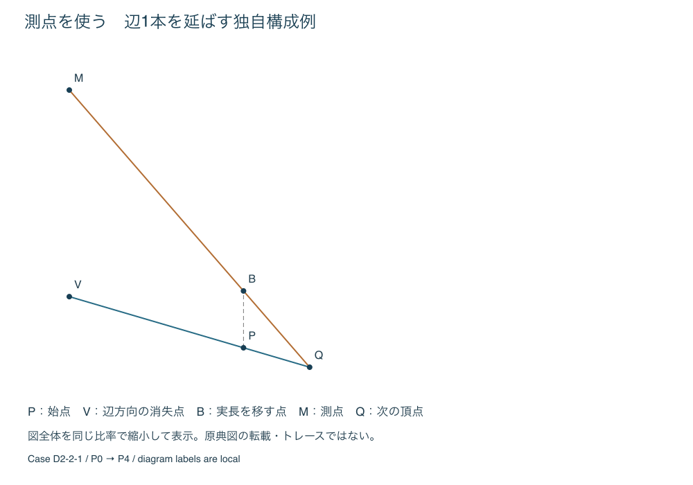

# 立方体の作図方法と紙外の点の比較

## 採用する役割

**普段使いの第一候補は頂点別の計算法、仕組みの理解と独立照合は視線の補助図、測点法は長さの移送を学ぶ比較用**とする。これは人の時間・容易さの実測順位ではない。紙面と誤差の模擬検査から定めた、手順書の案内順である。

| 方法 | 適用範囲 | 紙外への対応 | 今回の判断 |
| --- | --- | --- | --- |
| [半辺と割算](../../methods/drafts/cube-depth-scale.md) | Z>0の任意姿勢 | 消失点不要。仕上がりだけを確認 | 主経路として手順化 |
| [視線の補助図](../../methods/drafts/cube-ray-construction.md) | Z>0の任意姿勢 | 補助図全体を同率で縮める | 基準法。大きな縮小は避ける |
| 下記の測点による辺の移送 | 単一画面の中心投影。平行・重なりは分岐 | 全構成点を同率で縮める | 幾何学的に成立。遠い消失点では主経路にしない |
| 石川の正面長方形の構成 | 原典の図と手順の条件 | 本研究の正解との一致を確認できない | 基準法として見送り |
| Illinoisの三角形と対角消失点 | 三点透視の構成 | 大きな補助図が必要になり得る | 図と説明を確認。実行経路は下記の独自導出で統一 |

## 原典の図と照合したこと

[Ruskin](../../references/books/ruskin-elements-perspective-point-construction.md)の図4・5では、上・下にある点を視線の交点へ移す構成を確認した。[Storey](../../references/books/storey-1910-perspective-measuring-points.md)の図85、116、124では、対応する量を縮める操作と、測点で長さを移す操作を確認した。スキャンの線位置を正解座標として採寸していない。

[Illinoisの図](../../references/articles/illinois-recipe-for-cube.md)では三消失点・対角方向を確認した。ただしその教材の全構成を再実装したとは扱わない。本研究の三点への対応は、次の一般方向の測点を独立導出し、基準座標と照合することで確かめた。

取得経路・図番号・照合範囲は[実施記録](../topics/2026-10-02_cube-construction-execution.md)を参照。

## 測点で一辺を移す手順

これは古典の長さ移送の考え方を、同じ視点座標で比較するために整理した独自構成である。原典の全手順の再現ではない。

始点の3次元位置P=(X,Y,Z)、その投影p、延ばす単位方向e=(ex,ey,ez)、長さLを用意する。紙上倍率mは最後に掛ける。以下はm=1の補助図で行う。

1. ez=0なら辺は画面に平行。pから画面内方向(ex,ey)へ長さfL/Zを取ればよい。平方根キーは不要で、方向を作図し、定規・コンパスで長さを移せる。
2. ez≠0なら消失点V=(f ex/ez,f ey/ez)を求める。p=Vなら辺が視線上に重なり、もう一端もpへ投影される。通常の交点操作を省略する。
3. pVと45度以上交わる測線方向wを、水平・垂直のどちらかから選ぶ。pVが横に近ければwを上、縦に近ければwを右へ取る。
4. 画面原点からVまでの距離とfを直角三角形の2辺とし、その斜辺長rをコンパスで得る。r²=|V|²+f²で、r=f/|ez|に等しい。
5. Vからwと逆方向へrを移した点をMとする。ただしezが負ならwと同方向へ移す。これが今回の測点。
6. pからw方向へfL/Zを取り、点Bとする。これはPを通り画面に平行な平面内で実長Lを測ったときの紙上の長さである。
7. 直線pVと直線BMの交点Qを取る。必要なら線分の外へ延長する。QがP+Leの投影となる。

fL/Zが必要なので、測点法なら計算が不要とは言えない。Pが画面上にあればZ=fとなり、この測長はそのままLになる。古典で基線を画面上へ置く利点がここにある。

### なぜ長さが正しくなるか

3次元の補助点をB3=P+Lwとする。wは画面内の単位ベクトルなので、B3の投影はB。目標点Q3=P+Leへ向かうB3Q3の方向はe−wで、その消失点がMである。一方PQ3の方向はeなので、QはpVにもBMにも属する。これで辺の方向だけでなく長さLが定まる。

実装は、測点の円弧半径と2直線の交点からQを求める。Qの正解投影座標を入れて交点を作ってはいない。出発点P0だけを視線の補助図で求め、P0→P4、P0→P2、P0→P1、P4→P6、P4→P5、P2→P3、P6→P7の7辺を順に作る。残る5辺は得られた点どうしを結ぶ。

出発点以外でも、その頂点のZと方向eは入力表から求める。前処理を省いた手数では比較しない。[geometry.py](../../assets/cube-projection-research/geometry.py)の `measuring_step` と `measuring_cube` がこの操作に対応する。

## 紙外の点を扱う

本比較ではp・V・B・Mの**すべてを同じ中心・倍率sで縮小**してから交点を取り、Qを1/sで戻す。補助図の平行移動も全点共通に行う。相似変換は直線と交点を保つので、理想状態では正確である。消失点だけを近くへ動かす処理は不正確なので採用しない。

Storey図85にある基線と距離点の対応した縮約は別の具体的な構成であり、あらゆる測点図へ同じまま使えるとはしない。今回の汎用比較は全体の同率縮小に限定する。

縮小した点を±δmm読み違えると、戻すときに少なくとも縮尺に応じた増幅が生じ、交角が小さければさらに悪化する。0.1度の境界例では、理想値は一致しても測点を扱う図が極端に小さくなる。[感度検査](../topics/cube-construction-sensitivity.md)の結果から、その条件では頂点別計算法へ切り替える。

## 石川論考の画面条件を照合した結果

図1〜12を画像で確認した。特に第2節(1)、図4の長方形の構成を、同節で画面とされるPQの平面へ中心投影するモデルと比較した。

独自の数値例では、側面図のO=(0,0)、P=(100,0)、正面上端=(100,−40)、下端=(100,−100)、辺長60とした。OQ=OPの構成から画面PQを定める。原典の操作で得る長方形の幅は60。一方、このPQを実際の画面として四隅を中心投影すると、上辺約51.472、下辺約42.426となる。一つの共通倍率を変えても、異なる二つの幅をともに60にはできない。

これは**本研究が採用する単一画面モデルとの不一致**を示す条件付きの反例である。作者の意図や教育上の有用性全体を否定する結果ではない。[再構成コード](../../assets/cube-projection-research/source_model_check.py)と[数値](../../assets/cube-projection-research/source-model-check.json)を保存した。このため基準作図としては採用しない。

## 照合結果の範囲

有限34条件、一般姿勢200例、視線に重なる辺の例を、独立した世界座標の交差計算と比較した。幾何学的成立は上の導出が支え、数値例は実装を点検する。人の手で同じ結果が出ること、速さやわかりやすさは別に確認する必要がある。
