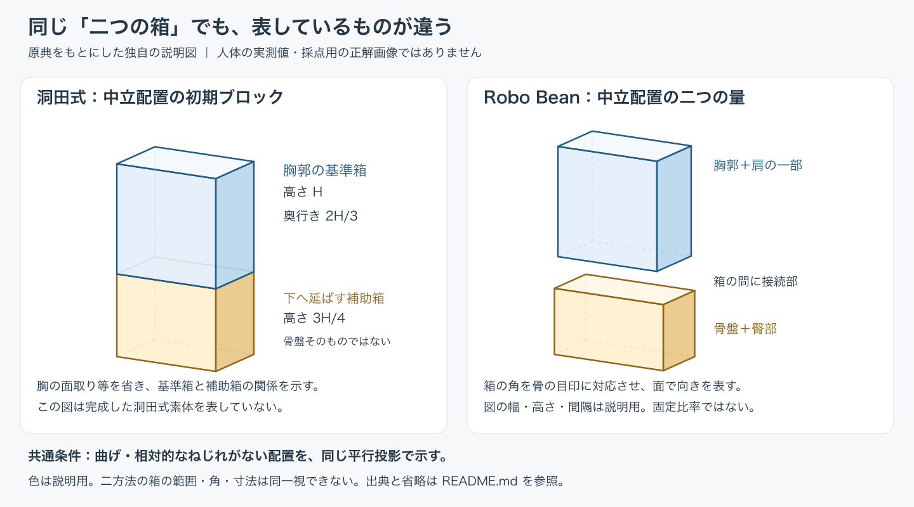
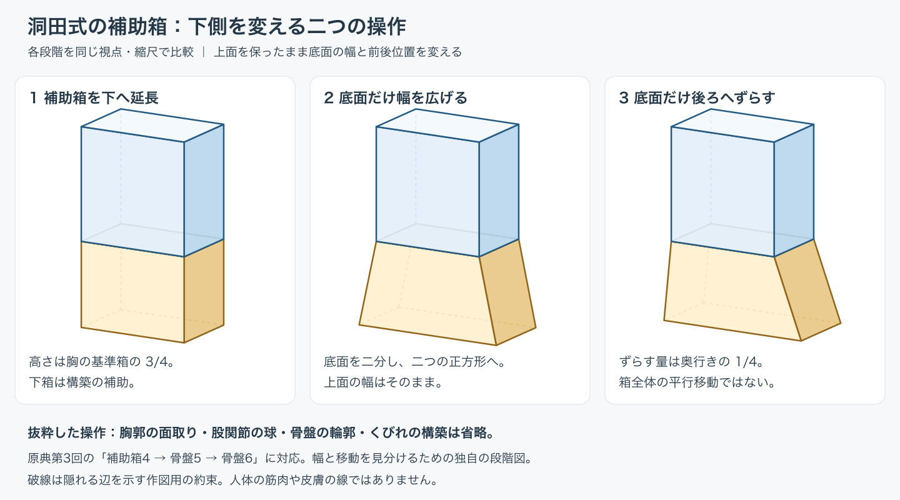

# 洞田式とRobo Bean：体幹の構築手順と箱の意味を比較する

**箱を二つ描いても、同じ構造を表しているとは限らない。** 洞田の初期下箱は後の形を作る補助で、Robo Beanの下箱は骨盤と臀部を含む量を表す。高さ比や角をそのまま交換すると、方法の比較ではなく対象の取り違えになる。

[洞田の原典照合](../../references/artists/toda-kobun-method.md)は第3・7回本文と掲載図、[Prokoの照合](../../references/videos/proko-robo-bean-and-obliques.md)は公式Lesson Notesと指定図3点を根拠にする。いずれも教材の提案であり、両者の効果を比べる実験ではない。

## 共通姿勢をどうそろえたか

採用した共通姿勢は、上下の主要な向きがそろい、曲げ・相対的なねじれがない中立配置。原典の基準モデルを説明する段階を比較し、同じ平行投影の視点で独自に作図した。人体写真に適用した実践結果ではない。

[編集可能なSVG](../../assets/torso-construction-comparison/neutral-comparison.svg)。洞田側は胸郭の面取りを省いて、基準箱と補助箱の寸法関係を示す。Robo Bean側も腹部の接続曲面や全身を描き込んでいない。共通なのは姿勢と視点で、同じ解剖的な領域・比率・完成度の像ではない。

## 目的・基準点・省略

| 比較項目 | 洞田式の体幹構築 | ProkoのRobo Bean |
| --- | --- | --- |
| 解こうとする問題 | 比率・分割・立体部品から素体を組む | 体幹の動きと面の向きを明確にする |
| 前提 | 箱の奥行き、分割、回転・傾斜を区別する | 箱・円柱の立体、Beanの動きの理解 |
| 上側 | 胸郭の基準箱から面を切り、形を作る | 胸郭と肩の一部を包む単純な量 |
| 下側 | 高さ3/4の補助箱を変形し、骨盤・股関節等へ進む | 骨盤と臀部を含む量。胸との間に接続部 |
| 基準点 | 中点・分割点・対角線・更新後の背骨の折れ点 | 鎖骨、肩甲棘、ASISなど観察可能な骨の目印 |
| 残す情報 | 部品の比率と配置、前後関係、組立の操作 | 面の向き、上と下の相対的な動き、接続 |
| 省く情報 | 初期箱では皮膚・筋の詳細、個体差の多く | 筋や骨の正確な全形、細かな輪郭 |
| 原典の留保 | 球の位置の代替、厚み補正、厳密比率への固執を避ける | 意図的な単純化。個体差、視点に応じたねじれの重なりの訂正 |
| 当資料の限界判断 | 数値の再現だけではポーズ・自然さ・創作を評価できない | 箱の角をすべて同じ解剖点とみなせない。固定の上下比率を課せない |

Robo Beanの上箱下端は上端ほど明瞭な骨の目印に依存せず、下箱前面下端も厳密な骨の角と等しくない。原典が単純化している点を、採点時に架空の「解剖学的正解」へ変換しない。

## 手順を追う

### 洞田：原典に示された構築の順序

第3回は基準胸箱 → 胸の前後の切断・正中線 → 下へ補助箱を延長 → 底面の幅と前後位置の変更 → 股関節の球 → 骨盤とくびれ、という組立。比率は三次元の指定であり、紙面上の辺の比をそのまま測ると投影の影響が入る。

この段階図は「補助箱4→骨盤5→骨盤6」を抜き出したもの。**箱全体をずらす操作と、底面だけをずらす操作は異なる。** 胸の面取り・関節の球・くびれを省いた理由と座標は[図版README](../../assets/torso-construction-comparison/README.md)に記録した。

第7回のポーズへの適用は胸郭 → 仮の背骨 → 胸に対して回転させる骨盤 → 傾き → くびれ。第3回の基準形作成と、第7回のポーズ配置を一つの必須筆順に混ぜない。原典には省略・代替・後の補正があり、完成後も初期箱の規則すべてを固定し続けるわけではない。

### Robo Bean：本文を作業へ整理した順序

以下はLandmarks・Differences・Motion・Twistから**当リポジトリが整理した手順**で、公式動画の筆順の転記ではない。

1. 参照で上側・下側の量と、見える骨の目印を区別する。
2. 各量を包む箱の前面・側面・上下面の向きを決める。
3. 個体の比率を観察し、上下の間隔と相対的な向きを置く。
4. 接続部の圧縮・伸び・ねじれを整理し、見える面に応じて重なりを確かめる。
5. 参照へ戻り、面の向きと骨の目印の対応を点検する。

初めから筋の輪郭を網羅する方法ではない。原典は前後面と側面でねじれの重なりを描き分け、近い角が常に上に重なるという一律のルールを補足・訂正している。接続部の詳しい有料解説や実演の全工程は未確認であり、ここを著者の完全な教程とは呼ばない。

## 他の姿勢・方法をどこまで採用したか

| 対象 | 確認できたこと | 今回の図への採否 |
| --- | --- | --- |
| 側屈 | 両教材に傾きと圧縮・伸びの説明がある | 共通の変形量・接続輪郭を独自に決める必要があるため、完成比較図は保留。中立配置の図を側屈の検証に数えない |
| ねじれ | 洞田第7回の胸と骨盤の相対回転、Prokoの面別の重なりを確認 | 定性的な違いは本文に採用。同じ解剖点・角度を保証する比較図は未作成 |
| Bean | 丸い二つの量で動きとつながりを扱う | Robo Beanの前提として併記。今回独立した第三の図解比較に数えない |
| [Bridgman](../../references/books/bridgman-1920-constructive-anatomy.md) | Constructionの図版で主要な量の傾き・ねじれ・接合を確認 | 歴史的な共通点を補足。図から描く順序を推定して数値教程へしない |
| [リクノ](../../references/books/rikuno-2015-line-design.md) | p.108の胴体・衣服の方向付けにいもむし理論を応用 | 応用例として残す。第2章定義が未確認のため手順比較の第三方法に数えない |

リクノp.108は、観察された形でも見え方を考えて採用する線を選ぶ例になっている。ただし、この一頁だけから箱パース・線画裏立体把握まで統合した理論を再構成できない。

## 比較から課題仕様へ

まず方法内で「この箱は何を表すか」「どの基準点を使うか」を採点可能な記述へ落とす。その後、同じ技能を比べるなら別途共通の課題を定義する。洞田の補助箱比率とRobo Beanの骨盤箱比率の一致を、二方法共通の正解にはしない。

図の生成・表示の点検は[図版README](../../assets/torso-construction-comparison/README.md)、今回の取得範囲は[収集記録](../topics/2026-10-02_collection-torso-and-memory.md)、観察・記憶・別角度の区別は[課題仕様](../../methods/drafts/torso-observation-memory-task-spec.md)へ引き渡す。中立配置で二方法を比較する範囲は完了し、人体の描画結果や優劣は未評価。

追加の[操作別比較](figure-abstraction-operations.md)では、主要な量・面と軸・断面と曲面・骨の目印・接続と変形の5つに整理し、独自図2点で説明しています。
